2021-04-01 23:22 [集智俱乐部](https://3g.163.com/news/sub/T1484902306242.html)

[直播预告：AAAI 2021专场二 - AI TIME PhD_AITIME_HY的博客-CSDN博客](https://blog.csdn.net/aitime_hy/article/details/114362966)

## 导语

人多智能体路径规划，英文叫Multi-Agent Path Finding，简称为MAPF。MAPF的研究主要有两大方向，一个是如何改进现有的算法，一个是在实际应用中如何处理约束，在此次AAAI中，南加州大学计算机系博士李娇阳一共有四篇论文被选中，这4篇论文契合了这几个方向，在这篇文章中，作者李娇阳对这四篇文章依次进行了介绍

李娇阳**- 作者**

AI TIME 论道**- 来源**

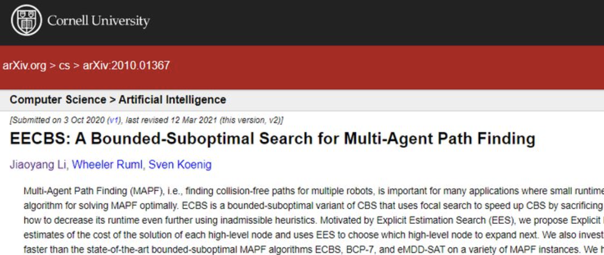

论文题目： EECBS: A Bounded-Suboptimal Search for Multi-Agent Path Finding 论文地址： https://arxiv.org/abs/2010.01367

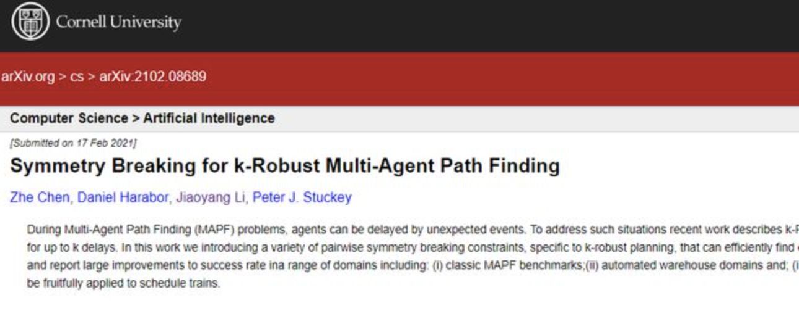

论文题目： Symmetry Breaking for k-Robust Multi-Agent Path Finding 论文地址： https://arxiv.org/abs/2102.08689

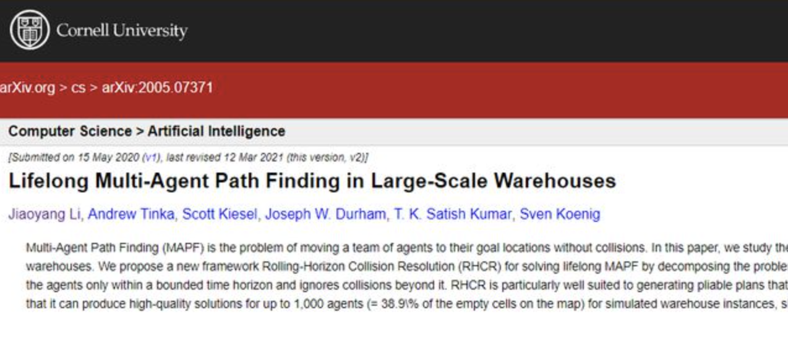

论文题目： Lifelong Multi-Agent Path Finding in Large-Scale Warehouses 论文地址： https://arxiv.org/abs/2005.07371

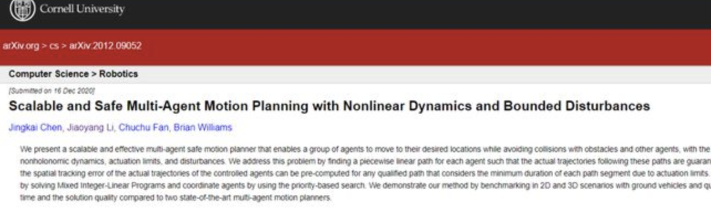

论文题目： Scalable and Safe Multi-Agent Motion Planning with Nonlinear Dynamics and Bounded Disturbances 论文地址： https://arxiv.org/abs/2012.09052

## 一、背景

　　**多智能体路径规划，英文叫Multi-Agent Path Finding，简称为MAPF。**它本质上是一个数学问题，通过给每个机器人规划一条路径，保证这些路径不相撞，并最小化总的运行时间。

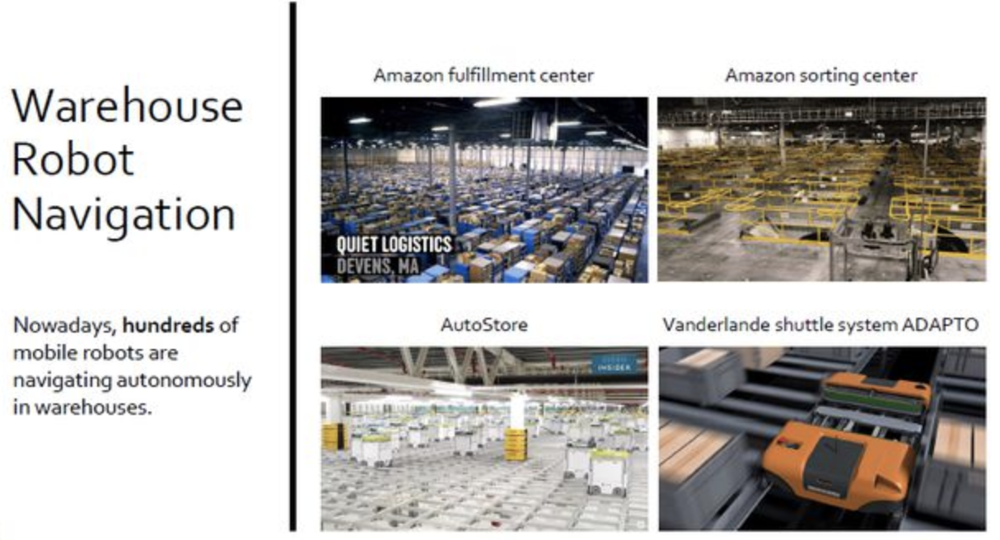

它有很多实际应用，其中一个是仓储系统。近年来机器人仓储系统吸引了很多人的注意，出现了各种各样的仓储系统，比较典型的有亚马逊的Kiva system，以及sorting center，和一些比较新的系统。这些系统本质上是给成百上千个机器人同时做规划路径，然后保证它们既不相撞，同时又能很快的到达目的地。

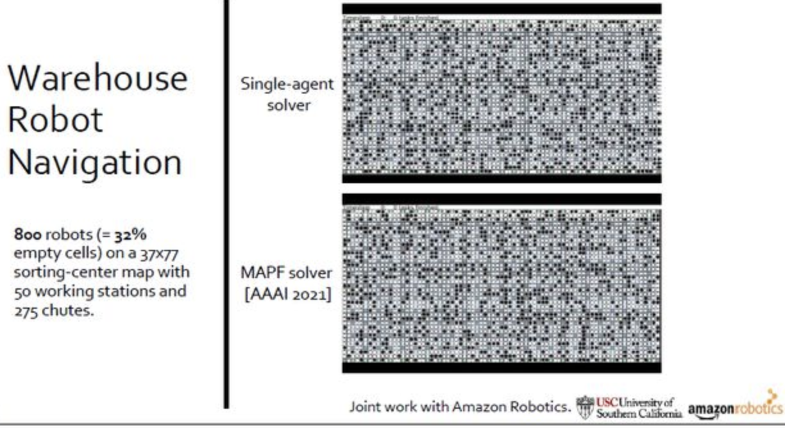

　传统方法采用single-agent方法，通过给每一个机器人规划它们的最短路，或者最小时间路径。如果两个机器人可能相撞，就用一些简单的交通规则处理，比如说其中一个机器人减速或换一条路。但这种方法在简单的系统中工作较好，一旦机器人数量或密度增大，就会出现拥堵，导致整个系统效率变低。而MAPF solver把所有机器人的路径一起规划，会考虑到各种碰撞的可能性。在同等情况下，MAPF solver可以很好的去调度所有的机器人的路径，使得它们可以顺畅的到达目的地。

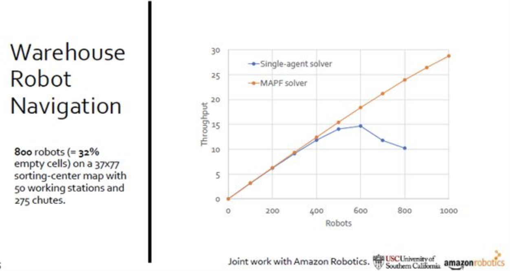

　这张图展示了不同机器人个数下，系统吞吐量的变化。可以看到在一开始的时候，两种方法很接近，基本上保持线性增加，但是当机器人个数到一定值的时候，Single-agent会出现拥堵，导致系统的吞吐量增长率开始下降，经过巅峰之后，增长率开始下降，这是因为系统中出现了严重的交通拥堵，导致系统开始瘫痪。而对于MAPF solver来说，在测试的1000个机器人之内，吞吐量几乎保持线性增长。

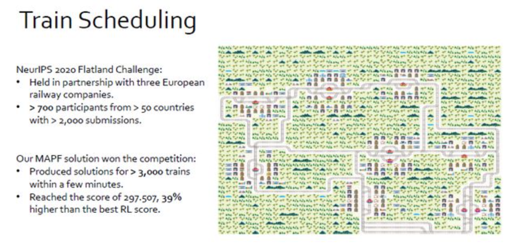

除了仓储系统，其还可以应用于交通系统，比如火车调度的例子。MAPF solution可以在几分钟之内调度3000多个火车到他们的目的地。

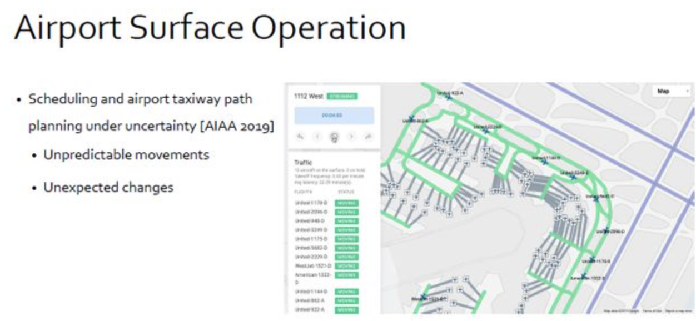

　　除火车调度以外，一个类似的应用是飞机调度，这是我之前和NASA合作的项目，我们如何用MAPF的方法来控制飞机的起飞与降落。这个问题的难点在于，飞机的控制包含有很多不确定性因素，例如天气干扰，人为因素干扰，所以我们要把MAPF模型和随机模型结合起来，考虑到各种因素干扰，控制整体的调度与运行。

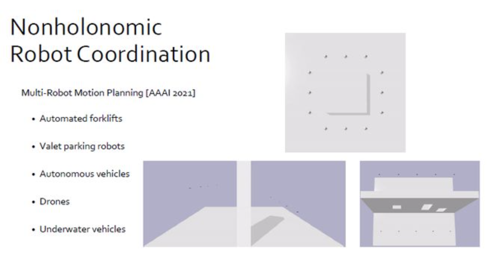

　　MAPF还可以被用到很多机器人系统中，比如说自动叉车，自动停车系统，无人车、无人机以及一些水下机器人。对这些系统一方面要避免碰撞，另一方面要去考虑各种机器人不同的动力学约束，比如说速度、加速度、转角，以及各种干扰的约束。如何把MAPF与这种约束结合起来，也是一个难点。

　　那么总的来说，其实**MAPF的研究主要有两大方向：**

- 一个是针对MAPF本身的问题，如何提高现有的算法效率和解的质量。
- 然后另一个是把MAPF应用到实际问题当中的时候，如何处理不同问题所带来的不同约束。

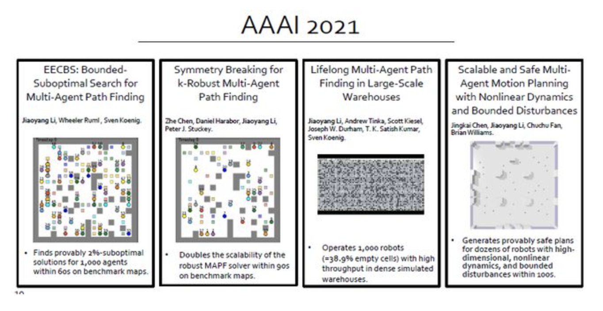

　本次AAAI，我一共有**4篇文章**被选中，我会依次介绍它们。

- **第一篇文章**是关于如何利用Heuristic方法加速现有的MAPF算法。
- **第二篇文章**研究了MAPF的一个延伸问题，叫K-Robust MAPF，它的逻辑就是很多情况下机器人是不会严格的执行每一个动作，可能会有延迟。所以当我们考虑到有一定延迟的时候，我们仍然希望最终给的解保证没有碰撞。这种情况下，这个问题会带来很多的 Symmetry因素，如何去消除这些因素，就是这篇文章所要解决的问题。
- **第三篇文章**就是刚才提到的仓储系统，如何去应对实时的、大规模的、不断动态变化的仓储系统，用我们现有的MAPF solver来解决这种Lifelong MAPF问题。
- **第四个**也是刚才提到的，考虑到机器人的动力学约束的时候，如何把它和MAPF模型结合起来。

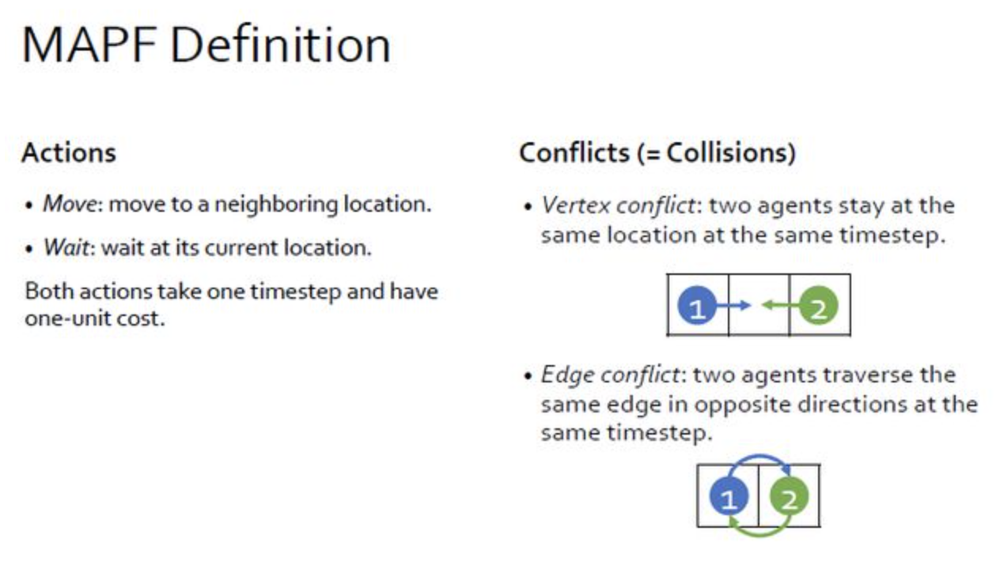

　　进一步定义MAPF，假设时间是离散化的，在每一个行动点，机器人可以选择两种动作，一种是移动到相邻的位置，一种是在当前位置等待，两种动作只需要一个行动点，而且他们的cost也是1。碰撞被称为collisions或者是conflicts，其有两种类型，一个叫vertex conflict，即在任意时刻内，有两个agent在同一时间到达同一位置；另一种叫edge conflict，即两个agent在同一时间去交换彼此的位置，或经过同一条边。所以**我们的任务就是生成指令，使机器人既能到达目的地，也不会发生碰撞，同时具有最小旅行时间和。**

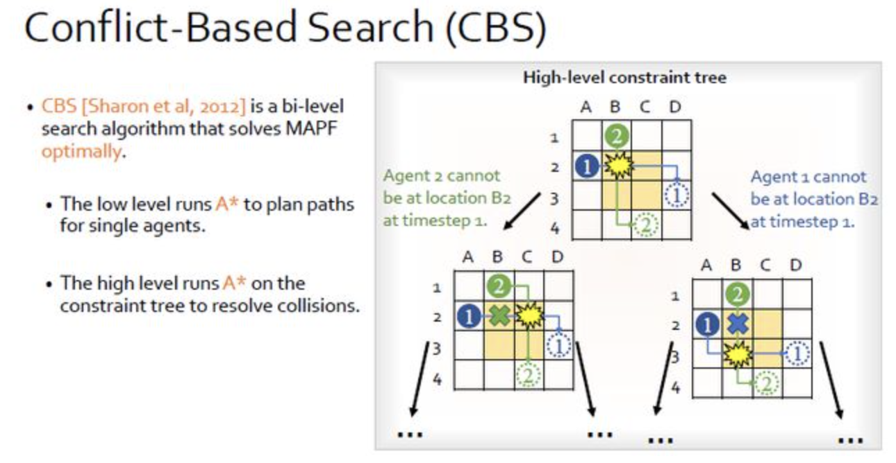

　**这里有一个比较主流且具有较好效果的MAPF算法叫Conflict-Based search或者CBS。**它是一个两层的算法，其逻辑为假设一个机器人想从A2到D3，一个机器人想从B1到C4。CBS最开始先给每一个机器人规划一条最短路，忽略另一个机器人或忽略其他机器人。检查当前的最短路有没有collisions，算法根据其中一个机器人是否执行当前指令分别生成两个子树并且加一个额外的约束。之后在各自的子树中重新规划路线，左边给agent 2重新规划一条路，右边给agent 1重新规划一条路。重复之前的过程，直到找到一个节点，里面的路径没有任何collisions。

## 二、EECBS: A Bounded-Suboptimal Search for Multi-Agent Path Finding

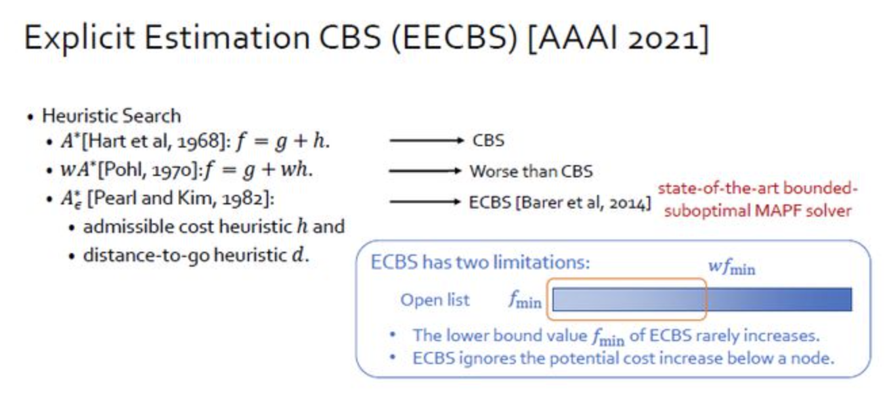

**第一篇我们提出了一个新的算法叫EECBS，这个算法从heuristic search的角度来分析如何来加速CBS。**heuristic search中最经典的算法就是A*，CBS的上层和下层都使用了A*，如果想让其运算更快，一个很常见的算法是用wA*。通过给h乘一个w，使得f更偏向于h的值，这样可以更快找到解，并且解在最坏情况下不超过w倍最优解。但是其表现会比CBS更差。这是因为在CBS中，h的值没有考虑中途可能包含的碰撞信息。于是在1982年有人提出算法来解决这种问题。A*ε里有两个heurisitic，一个是传统的A*会用到的admissible cost heuristic，然后另一个是distance to go heuristic d。这个d表示当前节点到goal node还需要展开多少个节点，heuristic用于估计这个事情。当人们把放到CBS框架中替换A*之后，发明了算法ECBS，它是目前最好的bounded suboptimal MAPF solver。

　ECBS通过一个open list存入所有的节点，并且按照f的值去排列。最小的叫f min，其是最优解的一个lower bound。而bounded suboptimal的要求只需要最终解的cost比wf min小。所以ECBS用d在橙色区域内选择合适的node作为解。但是实际中会有两个缺陷，第一个是因为f min基本不会变，也就意味着橙色区域没有解的情况下也不会发生变化，第二个是获得的解会比真实解大。

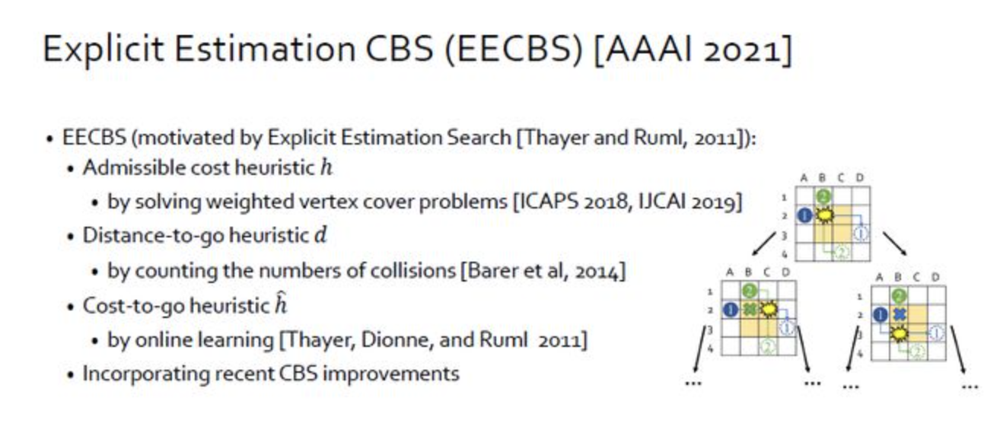

　**为了解决上述的弊端，我们提出了explicit estimation CBS，EECBS。**这个算法中包含了explicit estimation search和三个heuristic。第一个是A*中的h，第2个中的distance-to-go d，第三个是cost-to-go heuristic h’。第三个h’用于估计cost的增加量，并且不需要admissible，比h的准确度更高。

　	1. 第一个heuristic将问题转换为vertex cover，然后求解。

　　2. 第二个heuristic计算collisions的个数。

　　3. 第三个是online learning方法，在搜索过程中观察前面h和d的误差，然后反馈矫正得到更精确的h’的预估计。

　　4. 结合三个heuristic就可以克服之前ECBS提到两个缺陷。

​	    5. 此外，我们在EECBS中增加了近年来一些新的CBS improvements。

通过实验对比，CBS最多能解决的agent个数小于200，而EECBS可以达到1000个以上，而解的质量与最优解只有2%的误差。

## 三、Symmetry Breaking for k-Robust Multi-Agent Path Finding

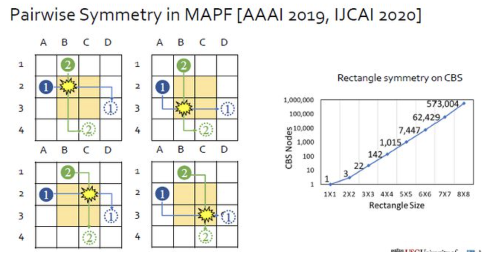

　　**第二个工作关于对称性以及K-robust MAPF。**观察上图发现每一个机器人可以有多条不同的路径。但是任意一条路径在黄色区域都有交集，这被称为symmetry。右图中，横坐标代表黄色区域的面积，纵坐标代表解决相撞问题时CBS的节点个数，图像显示随着面积增加，节点个数指数增大，尤其超过8×8后趋于不现实。

　　因为机器人不能够精准的以预定速度执行命令，所以需要k-robust MAPF制定计划，即对于任意数量的agent，延迟不超过k个时间单位，仍然可以保证不相撞，在左图中表现为后面的尾巴。但是这样也造成了更多的对称性缺点，中间图中是黄色面积图的延伸，可以看到随着k的增加，CBS需要的节点数也在增加。而右图显示的是随着k增加，rectangle symmetry出现的频率也在增加，会严重影响CBS效率。

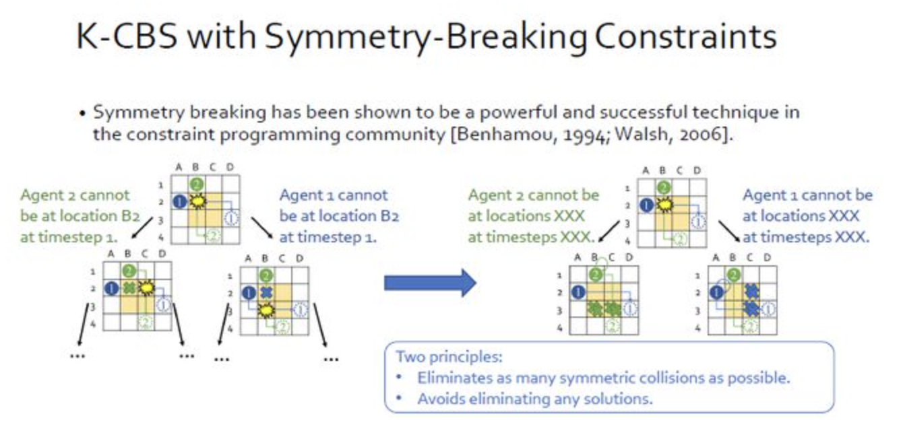

　　**为了解决上述问题，我们采用了一种名为symmetry-breaking constraints的想法，**其运算逻辑是通过设计constraint来消除symmetry，从而缩小搜索空间，加速算法。应用于CBS中，当出现一个symmetry时，就子树添加多个constraints，从而消除潜在的collision。而constraint的设计要遵循两个原则，第一个是尽可能多的消除collision，第二个是尽可能保留潜在的解。

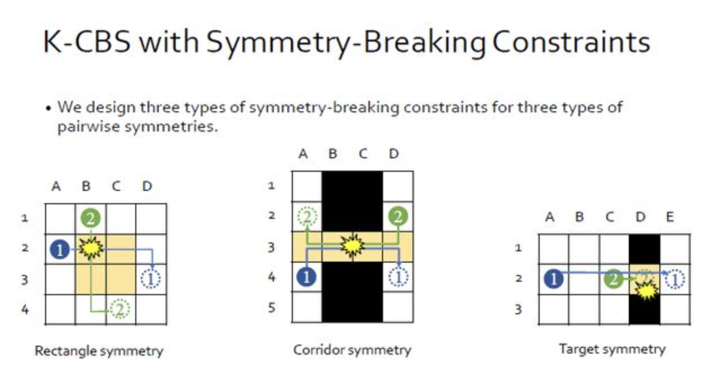

　　**本篇文章的核心是如何设计constraints，主要从三类symmetry入手：**

　	　1. 第一个是rectangle。

　　	2. 第二个corridor symmetry，它需要解决两个机器人如何从不同方向经过一个狭窄的过道。

　　	3. 第三个target symmetry，它面对的是一个agent已经到了它的目的地并且停止运动，另一个agent如何越过它。

　　我们在多种地图的情况下进行了测试，例如随机生成地图、游戏地图、仓库和火车网络，本文的方法对CBS有着显著的提高，对比之前可以对多一倍的数量求解。

## 四、Lifelong Multi-Agent Path Finding in Large-Scale Warehouses

　　**第三个是在亚马逊实习是完成的，称为Lifelong MAPF**，意图解决机器人在到达目的地后立即获得新任务的实时动态系统。

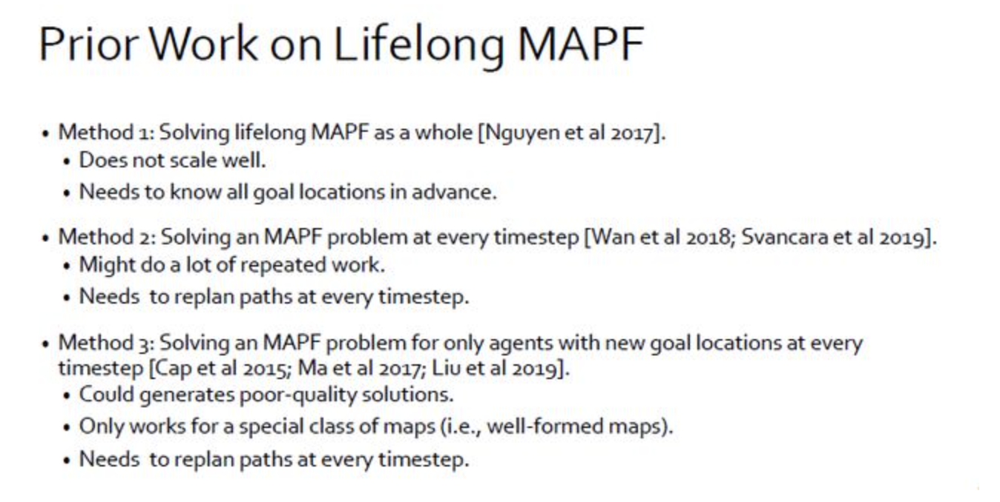

　　目前有三种方法：

1. 第一种从一个解决新问题的角度来思考，但是这种算法速度极慢，图中的文章只能解决20个agent。而且还需要知道所有的goal location，这对于仓储系统不现实。

　　2. 第二种是在每个行动点多运行一次MAPF solver，这个方法虽然只关心起始点，但是需要获得新任务后重新计算，造成重复性工作。此外实际系统中，机器人不会在每个time step中等待系统重新制定计划。
    　　3. 第三种是只针对有新任务的机器人做路径规划，机器人严格执行这个计划，并且不会进行改变。这个方法的缺点是解的质量差，且会出现拥堵，而且因为只涉及一部分agent，所以会出现无解的情况，只能使用于某一类地图，而且它同样要求每个行动点进行replan。

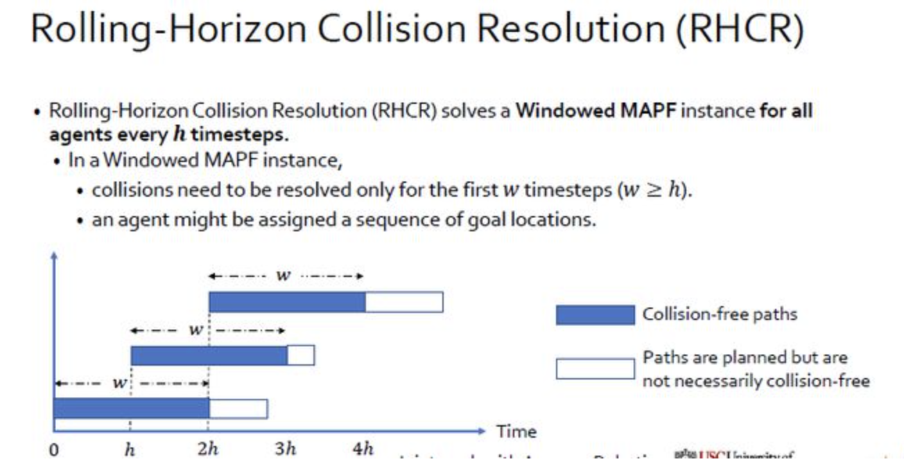

　　**本文提供了一个新的思路来解决这个问题，称为Rolling-Horizon Collision Resolution。**这个算法首先由用户提供参数h，之后每h timestep都进行replan。因为系统是在动态变化的，所以我们在当前replan只处理当前的collision，即在每h timesteps去处理一个windowed MAPF instance。之所以叫windowed MAPF基于两点，第一点是前w个行动点的collision，其中w大于等于h；第二点是一个agent可能会有多个目的地，为的是在h timestep之前能够保持持续行动。上图是一个大概的展示，横轴为时间，在0的时刻，给所有agent完整的plan，但是只处理前w步的collision，到第h个timestep时，重复上述步骤。

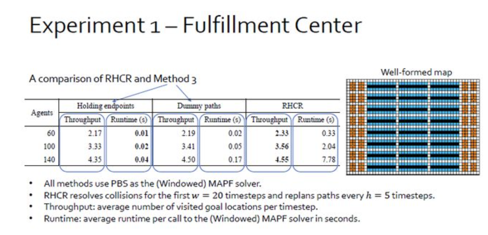

　　对于这个算法，一共进行了两组对比实验，第一组是和之前的方法三做对比。可以看到质量要比方法三好，但是时间在不考虑解的质量时要略逊色于方法三。所有对于适合的地图，并且单纯追求速度的话可以使用方法三，但是追求质量的话，本文的方法更合适。

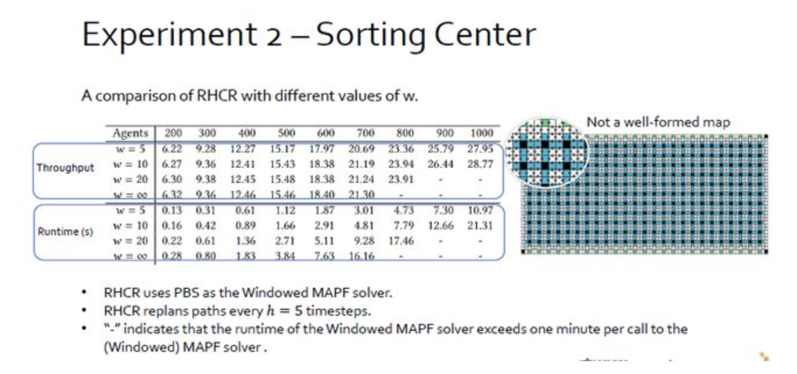

　　第二个实验选择了方法三不适用的地图，在此基础上使用了不同的w大小，观察对解的质量的影响。首先观察吞吐量，随着w的增加，吞吐量变化不大，这是因为只处理眼前的collision而不是所有之后可能发生的collision。另一方面，算法的速度随着w的增加会减慢，而且还涉及了能够处理agent的数量，例如当w趋于无穷，能解700个agent，而w为5或10就可以解1000个以上的agent。

　这个方法有4个优点：

- 它适用于任何地图
- 我们不需要每个时刻都去replan，而是由用户决定其频率
- 有了W之后，算法速度提升明显

- 在提升速度的同时能够保证解的质量

## 五、Scalable and Safe Multi-Agent Motion Planning with Nonlinear Dynamics and Bounded Disturbances

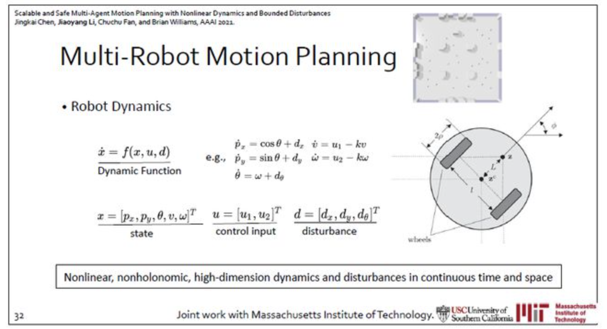

　　**最后一篇文章是如何将MAPF和机器人的各种constraint结合，称为multi-robot motion planning。**这里有一个比较典型的二轮车模型，我们会获得机器人所在位置的x、y，以及方向θ，速度和转速。输入是两个control input，一个是力，一个是力矩。因为考虑到机器人不会精确执行每一个动作，面临非线性，nonholonomic，high-dimension dynamics，以及外界干扰的情况，所以成为一个离散空间和离散时间的问题。

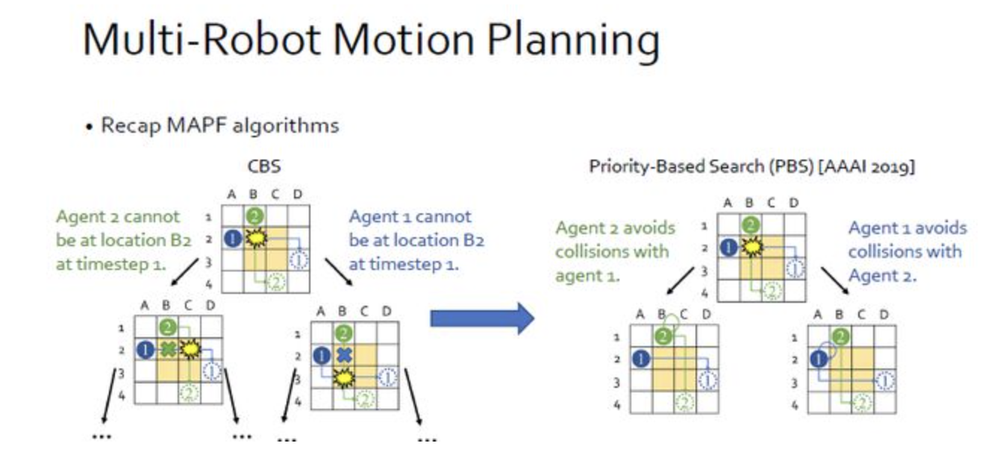

　　**重新思考MAPF算法，其本质就是考虑很多路径会不会有相撞情况，如果有就处理其中的conflict。**而这里我们没有采用CBS，因为其对于连续时间中，取一个点，会使得constraint没有意义，因为其需要一个位置和一个timestep。所以我们采用了priority-based search，即PBS，其与CBS的区别在于，当我们要处理一个conflict的时候，它给两个机器人的其中一个指派一个更高优先级，优先级低的那个 agent就要去避免和优先级高的那个agent去撞。左图就是agent 1优先级高于agent 2，所以要给agent 2重新规划路径。这样对于collision的问题就迎刃而解，接下来就是在不断的plan和replan的情况下，如何使得算法运行快。

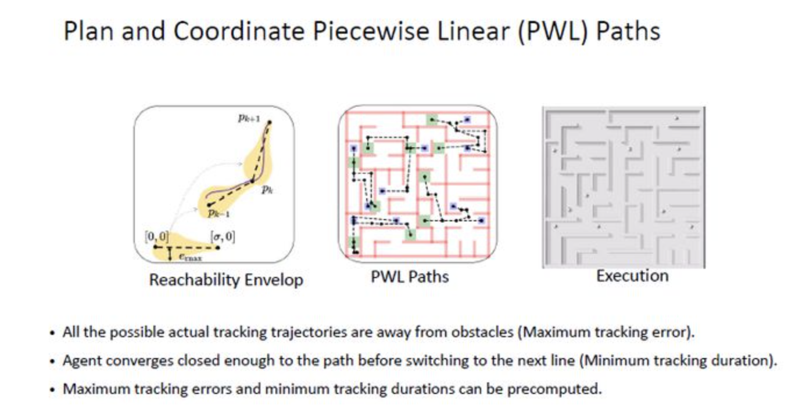

　　我们将piecewise linear path作为介质，称为PWL path。它将一个时间点和位置，即x，t组合成一个微point，两个微point之间通过直线段连接。在机器人实际执行过程中，我们用tracking controller作为跟踪器，让机器人跟随这条路径。而机器人会有误差，所以我们做了reachability envelop去分析，例如直线情况下，机器人的偏离误差，即maximum tracking error，以及最坏情况下，它至少需要花多久时间，从一个点移到另一个点，minimum tracking duration。计算出这两个误差的bound之后，通过MAPF solver获得最终解。

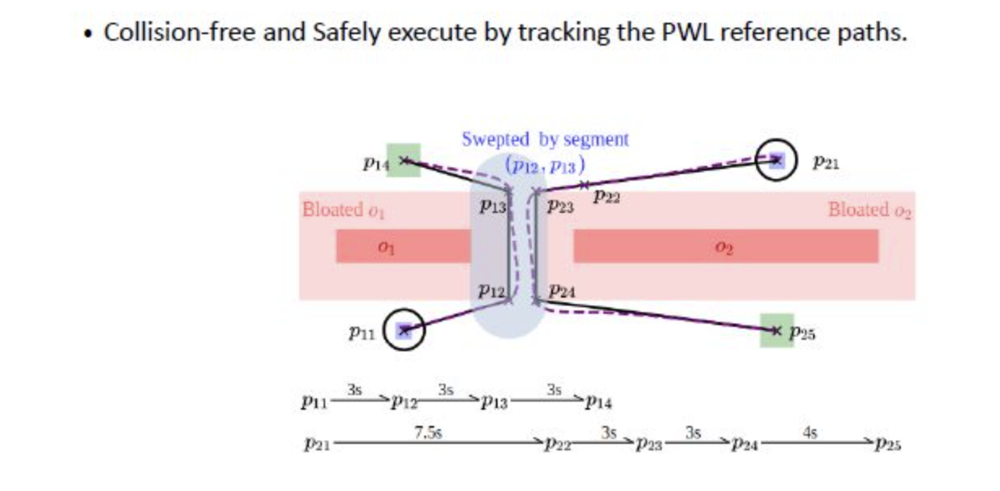

　　这里举个例子，如果有两个机器人，要通过中间的过道。

　　**第一步**先获得maximum tracking error，增大o1,o2障碍物面积，从而保证只要机器人的piecewise linear path在白色区域，那么就不会与障碍物相撞。

　　**第二步**给每个机器人找一条piecewise linear path，通过PBS逻辑检查是否会相撞。当前情况下会相撞，于是赋予机器人1更高的优先级，对于机器人2来说，机器人1就是移动的障碍物。同时考虑到其覆盖面积，编码时通过这些约束就获得另一条规划路径。之后通过tracking controller，使得机器人跟随两条路径，就可以保证不相撞的情况下到达目的地。

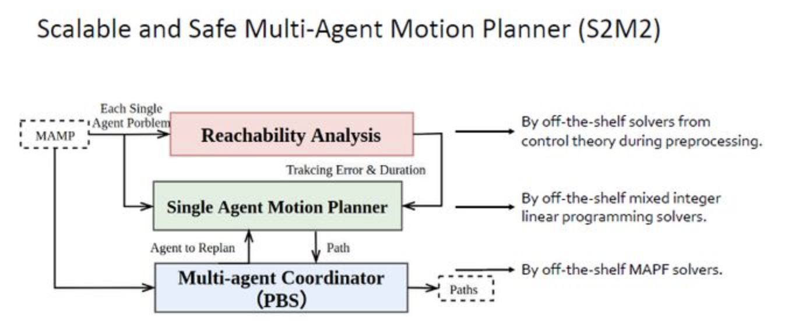

　上图是算法的框架图，称为S2M2，它包含了三部分：

- **第一部分**Reachability Analysis，用于计算maximum tracking error和minimum tracking duration。
- **第二部分**给每一个机器人规划一条piecewise linear path，将其编码成混合整数规划问题。
- **第三部分**把Single Agent Motion Planner和PBS结合，去处理agent之间的碰撞，得到collision free piecewise linear path，保证机器人能无碰撞的到达目的地。

　　

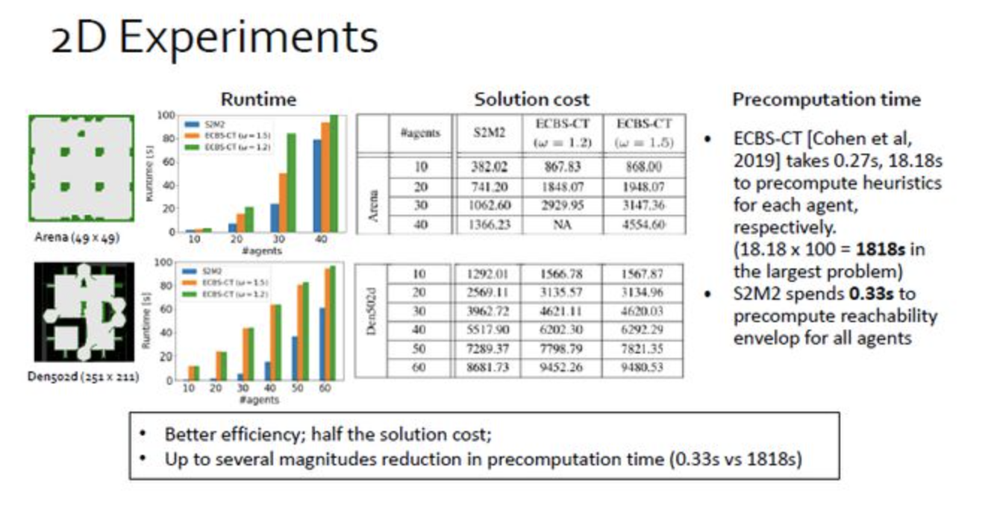

　　第一个实验在2D环境下与ECBS-CT方法做对比。不论从时间还是质量来看，我们的方法都占据优势，最好的情况能减少一半的时间，尤其是预处理时间。我们的预处理只做reachability analysis，大概只需要1s；而ECBS-CT则最多花费1800 s以上。

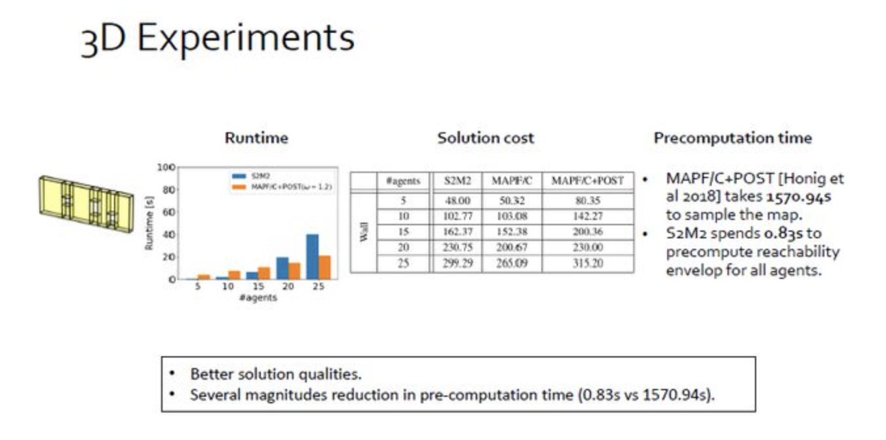

　　我们还在3D环境下与当前最好的求解器做了对比。我们解的质量随着agent的数量，优势尽显。对于时间，我们的预处理依然很快，而对方需要1500 s以上做离散化处理。

## 六、结论

　　最开始说到MAPF的**研究主要有两大方向，一个是如何改进现有的算法，一个是在实际应用中如何处理约束。**这4篇文章契合了这几个方向。

　　第一篇利用heuristic search方法，来指导搜索方向，从而加速算法。第二篇通过设计symmetry-breaking constraints来减小搜索空间，从而加速搜索算法。

　　剩余两篇将目光集中于应用，第一个是在讲在lifelong MAPF问题中，我们提出rolling-horizon collision resolution框架，通过只处理眼前的collision，从而加速算法。

　　最后一个在multi-robot motion planning的时候，考虑robot dynamics。通过piecewise linear path为介质，把tracking controller和MAPF就结合起来，设计了高效求解multi-robot motion planning的算法。

　　**李娇阳：**南加州大学计算机系博士四年级学生，导师Sven Koenig, 本科毕业于清华大学自动化系。目前主要的研究方向为人工智能，多智能体规划，组合优化，搜索算法等。以第一作者在AAAI，IJCAI，ICAPS，AAMAS等顶级会议上发表论文十余篇。曽担任Artificial Intelligence, IEEE Robotics and Automation Letters等期刊审稿人，AAAI，IJCAI，ICAPS等会议评审委员会委员，IJCAI会议评审委员会资深委员， 并组织举办了IJCAI-2020多智能体路径规划研讨会。曾获得2019年南加州大学技术商业化奖，2020年高通奖学金，2020年ICAPS最佳学生论文， 以及2020年NeurIPS Flatland挑战赛（Multi-Agent Reinforcement Learning on Trains）第一名。本次报告的其中一项工作（论文1）在Amazon Robotics实习期间完成。

**个人主页：**

　　https://jiaoyangli.me/

**直播回放：**

　　https://www.bilibili.com/video/BV1X54y1h7qm?share_source=copy_web