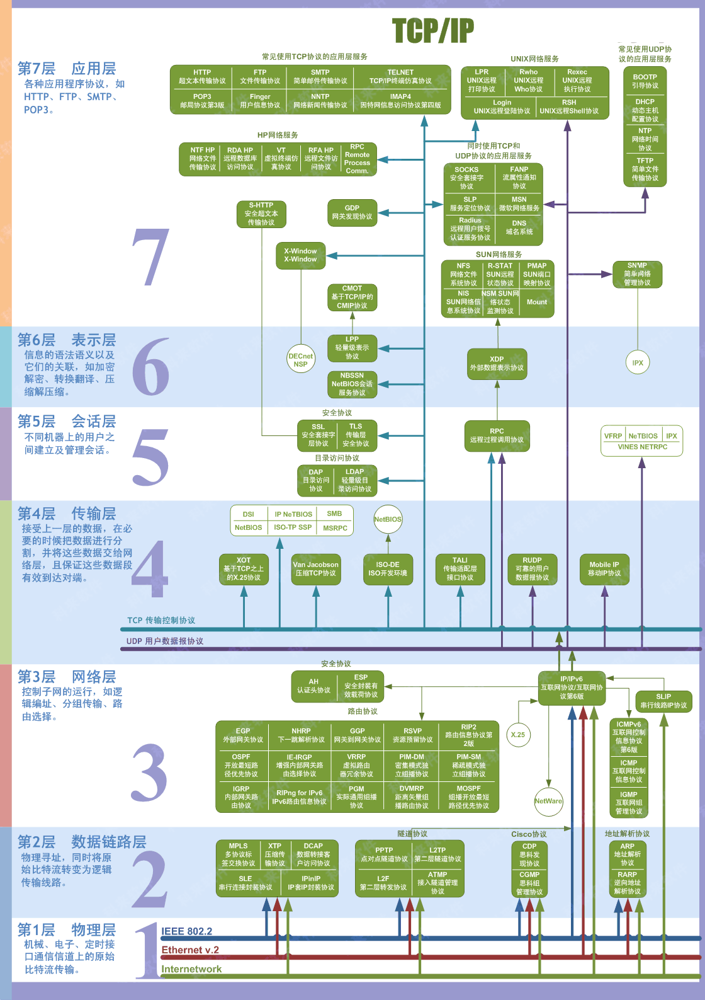

## 计算机网络入门

计算机网络分层的本质原因 ： **让不同的开发人员负责不同层**。

- **应用层** ： 开发应用程序的人 (user mode)
  - 应用程序
- **传输层** ： 开发操作系统、设备的人 (kernal mode)
  - 操作系统
- **网络层**： 路由器厂商
  - 路由器
- **数据链层** ：局域网的构建  
  - 在某些教材里，是网络层的一部分
  - 路由器 (小型 LAN)、网桥、交换机
  - 路由器上都会有3-4个LAN口，所以路由器也可以当一台交换机使用。
  - [自己家里的网络需要交换机吗？-悟空问答 (wukong.com)](https://www.wukong.com/question/6481394865279074573/)
- **物理层**：搞通信的人 (比如电波。。。)
  - 网卡，网线，集线器，中继器，调制解调器

可以发现， 这种方式极大地方便了开发人员。

只要管好自己的一亩三分地， 就可以了。 

有了这些了解， 就可以去看那些厚厚的书了，看的时候， 不要忘记每层对应的设备。

