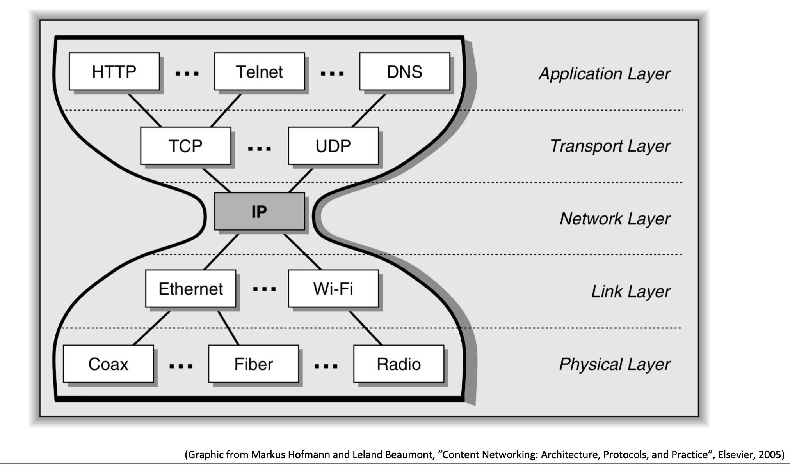

## 计算机网络入门

计算机网络分层的本质原因 ： **让不同的开发人员负责不同层**。

- **应用层** ： 开发应用程序的人 (user mode)
  - 应用程序
  - [【硬件科普】能上QQ但是打不开网页？详解DNS服务，DNS解析，DNS劫持和污染 - YouTube](https://www.youtube.com/watch?v=2QJLxhS2lXw)
- **传输层** ： 开发操作系统、设备的人 (kernal mode)
  - 操作系统
- **网络层**：骨干服务器、分支服务器（**ISP们**）
  - 企业级路由器 (路由算法、路由表是你的家用路由器能承受的吗？)
  - 我认为网络层应该是只**涉及公网 IP** 。 
  - [【硬件科普】IP地址是什么东西？IPV6和IPV4有什么区别？公网IP和私有IP又是什么？ - YouTube](https://www.youtube.com/watch?v=tVNx-6OEy-k)
- **数据链层** ：局域网的构建  (家用设备)
  - 网卡驱动 (有线、无线)、交换机、网桥
  - 这里有一个**易错点**：**家用路由器**并不是路由器， 而是**交换机**。
    - **家用路由器**有 **NAT网络地址转换** 和 **端口映射** (让多局域网机器***共享一个公网 IP*** ) 。家用路由器又叫 ***网关 (小区门卫)***。
    - 家用路由器应该要归到 Data-Link Layer 。
  - [【硬件科普】IP地址是什么东西？IPV6和IPV4有什么区别？公网IP和私有IP又是什么？ - YouTube](https://www.youtube.com/watch?v=tVNx-6OEy-k)
  - [家庭网络为什么需要路由器，家用路由器是用来做什么的，如何使用 - YouTube](https://www.youtube.com/watch?v=pE9cHa0KH0w)
  - 如果你搭建了一台服务器， IP 地址是 `192.168.xxx.xxx` ， 别把这个 IP 地址发给朋友们炫耀自己搭了一台服务器。
  - **可见子网也允许有 私有 IP 地址。**所以家用路由器也叫路由。**但其与企业级路由差别巨大**。
- **物理层**：传导的**介质**
  - 电流、光线、电波 （基本就是搞物理的人的事， 跟程序员无关）

可以发现， 这种方式极大地方便了开发人员。

只要管好自己的一亩三分地， 就可以了。 

有了这些了解， 就可以去看那些厚厚的书了，看的时候， 不要忘记每层对应的设备。

其中软件工程师最常用的就是 **TCP/IP** , 主要对应 **Transport 和 Network Layer** 。

- 这就是为什么面试只会问你 三次握手(操作系统层面)， DNS 和 HTTP ， 从来不问你 Ethernet 碰撞怎么办， 也不问你路由表的作用，因为大部分程序员也就止步于 Transport Layer ，除非你去华为之类的工组。

