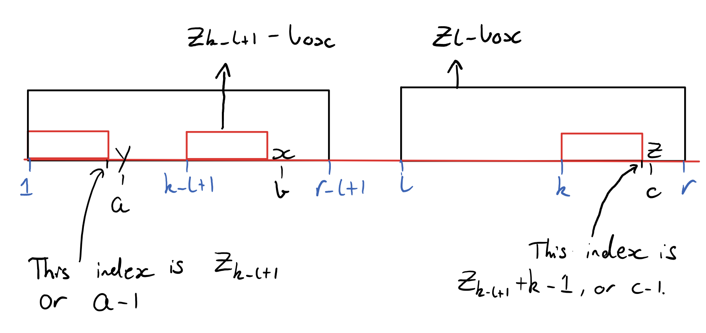
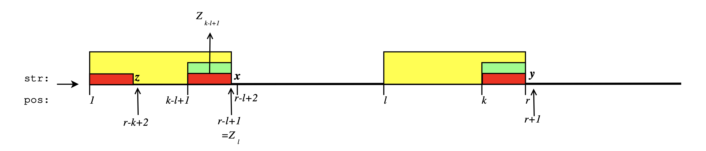
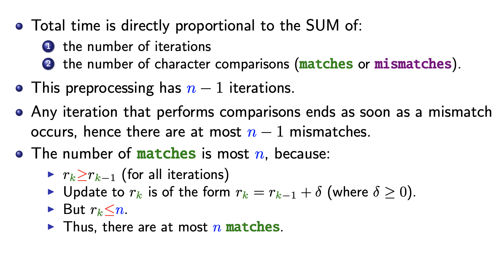

### [Home](./index.html)

# Z-algorithm 

## Case 2a

- **Z_box** has S[1…r-l+1] = S[l…r] 
  - any substring of S[l…r] must match the prefix S[1…r-l+1] 
  - the substring S[k…c-1] must match the substring S[k-l+1…b-1] in the  prefix
  - S[k…c-1] = S[k-l+1…b-1]
  - Similarly, S[c] = z is aligned with S[b] = x in the prefix and so we must have **z = x**
- **Z_{k-l+1}-box** 
  - S[1…a-1] = S[k-l+1…b-1] AND S[a] = y != S[b] = x.
  - Since, S[k…c-1] = S[k-l+1…b-1] AND S[1…a-1] = S[k-l+1…b-1] 
    - we must have, S[1…a-1] = S[k…c-1].
  - But since we **z = x** and **x != y** we have, **z != y.** 
  - **Z_k** we will match S[k…c-1] to S[1…a-1]
- No comparisions 

## Case 2b

- **Z_box** has S[1…r-l+1] = S[l…r] 
  - any substring of S[l…r] must match the prefix S[1…r-l+1] 
  - the substring S[k…r] must match the substring S[k-l+1…r-l+1] in the  prefix
  - S[k…r] = S[k-l+1…Zl]
  - x != y, otherwise, Zl-box would be longer (黄色区域叫 Zl-box)
- **Z_{k-l+1}-box** 
  - S[1…r-k+2] = S[k-l+1…Zl] AND S[r-k+2] = z != S[r-l+2] = x 
  - **x != y** and **z != x** does tell the relationship of **y** and **z** 
  - **str**[k . . . r] = **str**[k − l + 1 . . . Zl]
- But no information about from r 
- comparsions r to q 

## Time Complexity 

- **r_k = r_{k-1} + s** means  
