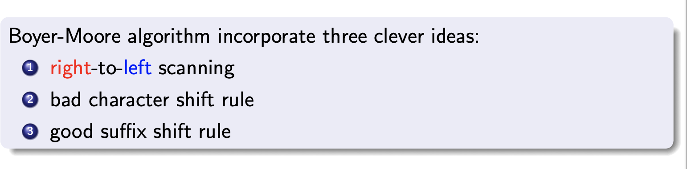
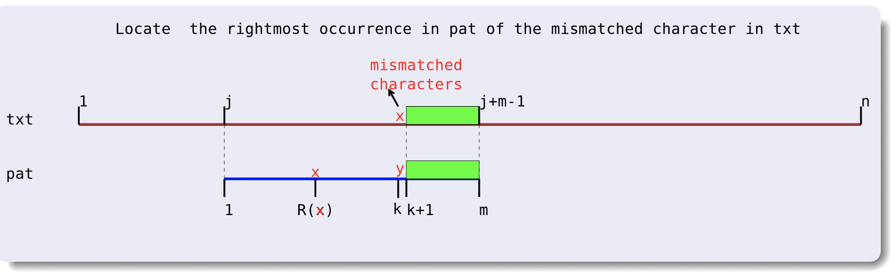
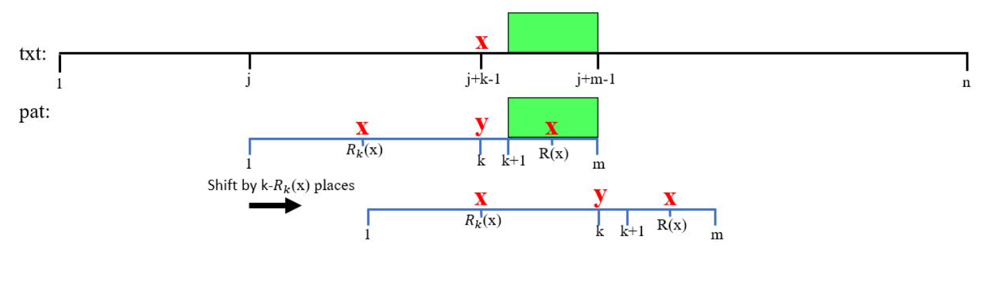
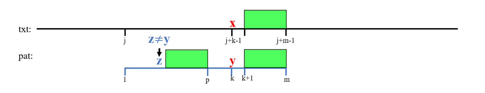
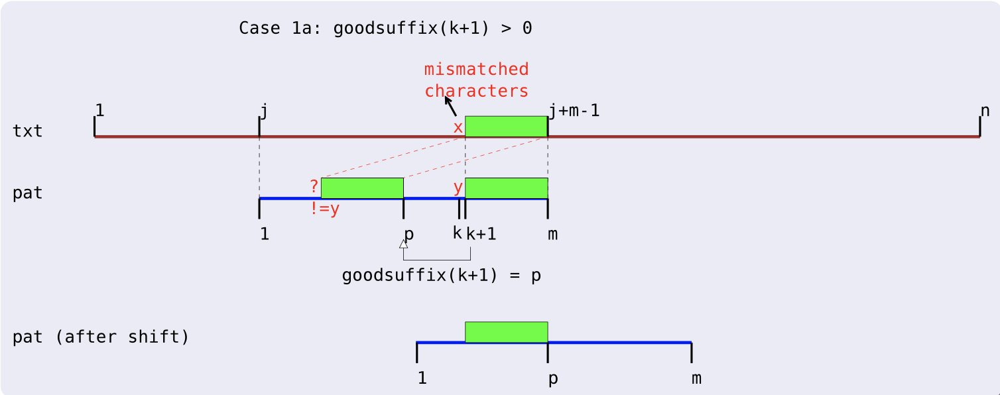
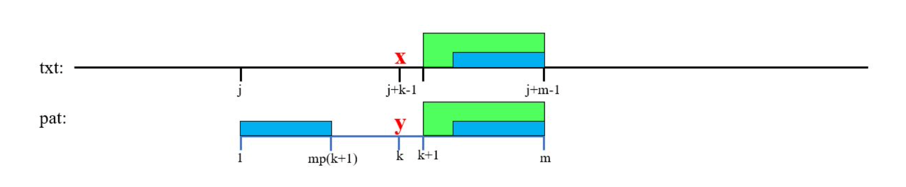
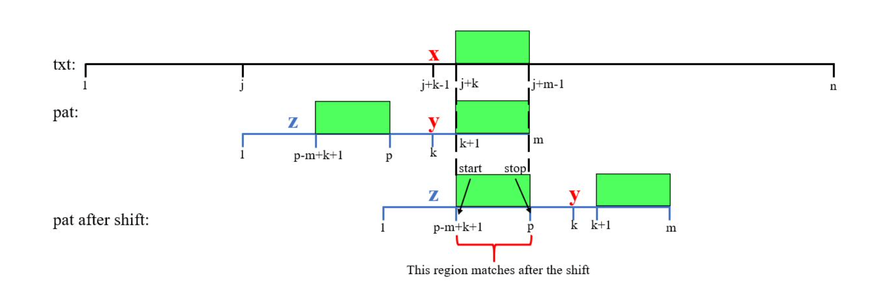
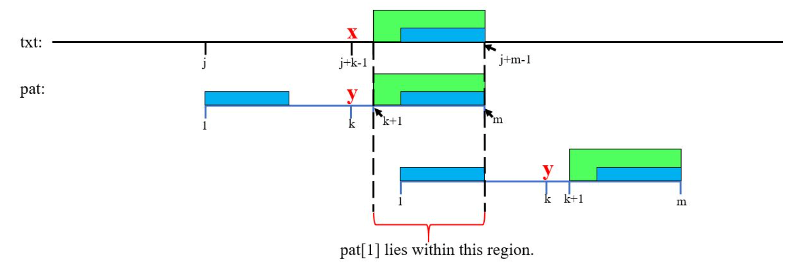
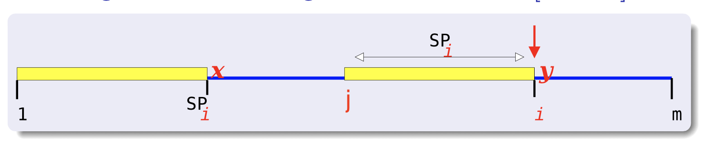
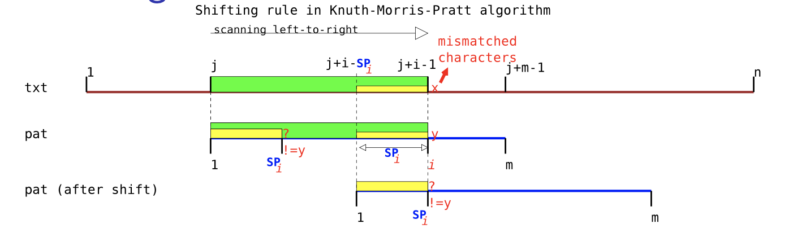

### [Home](./index.html)

# Boyer-Moore 

## Bad Character Rule 

- **R(x)**  is the the **rightmost position** of occurrence of character x in pat

## Extened Bad Character Rule 

-  mismatched character is **x = txt[j + k − 1]**,
- `R[k][x]` is the **closest x in pat that is to the left of position k**

## Good suffix rule

- **Reverse** the pat and **compute Zˆ{suffix}_p**, 
- For **p** = **1** to **m-1**
  - for each **suffix** starting at position **j** in pat,
  - **j** = m - **Zˆ{suffix}_p** + 1   
  - goodsuffix(**j**) = **p**

- Case 1a : If **Good Suffix** can be found, 
  - m − goodsuffix(k + 1) places.

- Case 1b: If **no** good suffix 
  - m − matchedprefix(k + 1) 

- Case 2: fully matched 
  - m − matchedprefix(2) places.

## Galil’s optimisation

## Time Complexity 

Given **txt**[1...10]=aaaaaaaaaa and**pat**[1...3]=aaa

Boyer-Moore will run **O(mn)**     

But Galil’s optimisation can make it linear **O(m+n)**. 

# KMP 

- **SPi** is the **length of the longest proper suffix of pat[1 . . . i]** that matches a **prefix** of pat, 
  - such that pat[i + 1] != pat[SPi+1].
  - **i** = **j** + **Z_j** - 1
  - **SP_i** = **Z_j**

- KMP shift pat by exactly **i − SPi** places to the right.
  - If an occurrence of pat is found, **m − SPm** places.

