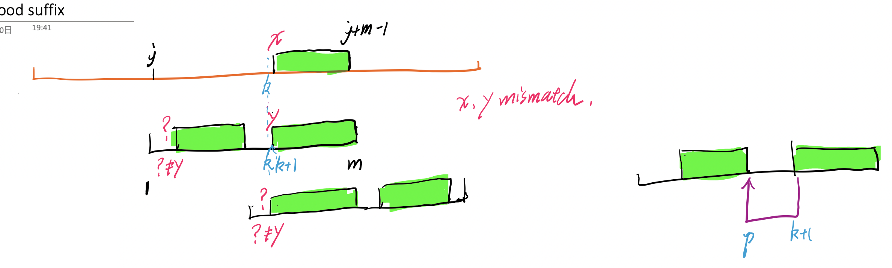
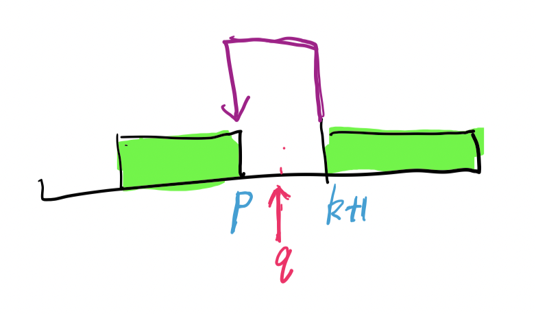
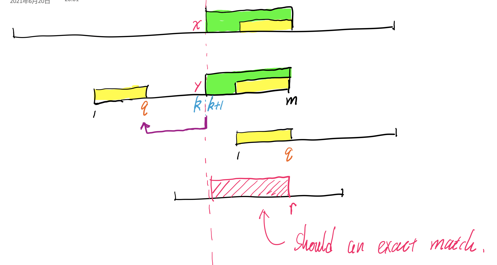
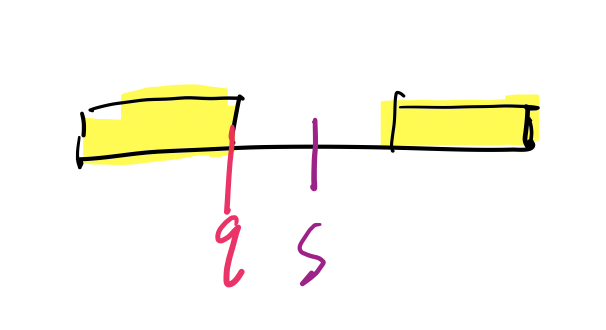
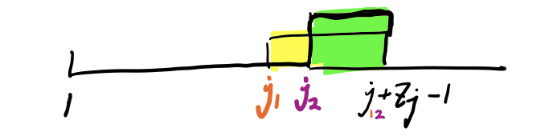

### [Home](./index.html)

# Galil’s optimisation

- **Describe the alignments** of Case 1a, 1b and Case 2 
  - how many characters to skip
  - how to align 
- Two successive alignments  **share the characters** in the text
- However, due to Galil's optimisation **we skip these comparisons**  in the current iteration 
  - so we examine **each character in the text once at most.**  (not repeated characters in the text)

# Boyer More 

## Good Suffix Rule - Case 1a 

- Assume the shift is **not safe** 
- 
- there must be a **q > p** indicates a **fully match**.
- But **p = goodsuffix (k+1)**  is the **right-most position** of **suffix S[k+1...]** in the pattern 
- But **q** is larger than **p** 
- Contradition 

## Good Suffix Rule - Case 1b

- Assume the shift is **not safe**
- there must be a position **r > q**  gives **an fully match**
  - that means there is **a good suffix from r** that **matches the suffix of the pattern**.
  - that means **goodsuffix(k+1) = r**        
- But the question says **goodsuffix(k+1) = 0**
- Contradiction 

## Fully Match

- **matchedprefix (2)** is the **longest proper suffix** of the pattern that matches its **prefix**.
- assume we missed **an excat match** that **require shift m - s** 
  - **s > matchedprefix (2)**
  - hence shift less **m-s < m - matchedprefix(2)**
- But   **s > matchedprefix (2)** 
  - there is **a longer proper suffix** that **has the length s**  

- Contradtion

# KMP 

## why compute SPi from m to 2 

- **Zj** is the length of the **longest substrings** of the pattern starting at **j** that matches the prefix 
- The end point of the **Zj-Box** is    **j + Zj - 1** 
- But there may be **multiple Z-Boxes end at the posiiton** but start at different position. 

- **Spi** should be the length of the **longest proper suffix of pat[1...i ]** that matches it prefix. 
  - that means use the **longest Z-Box** among **all Z-boxes that end at i** 
- From **m to 2**, the **Z-box** with the **earliest starting index** is stored. 

