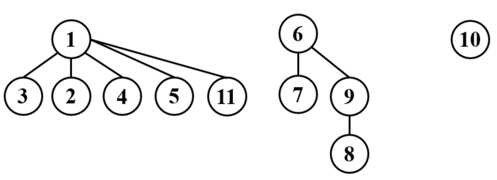
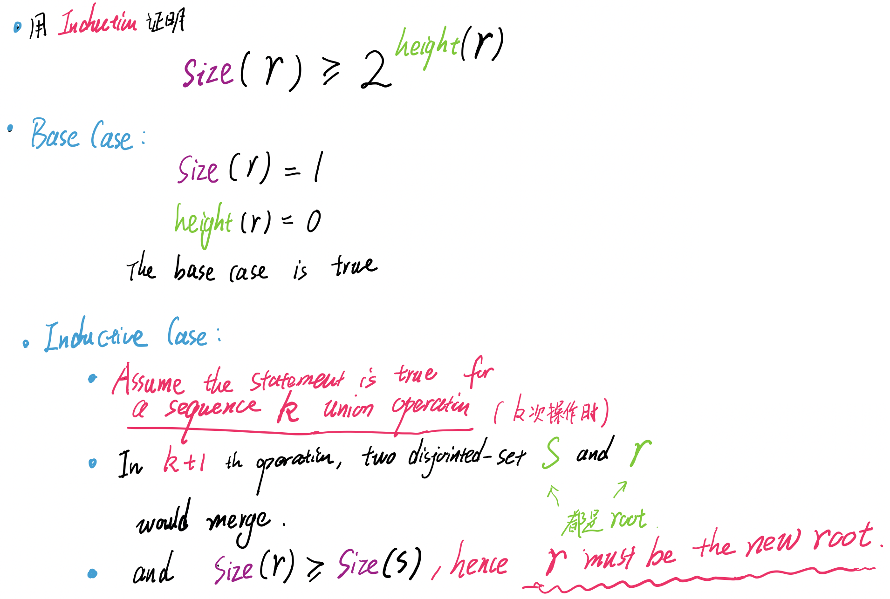
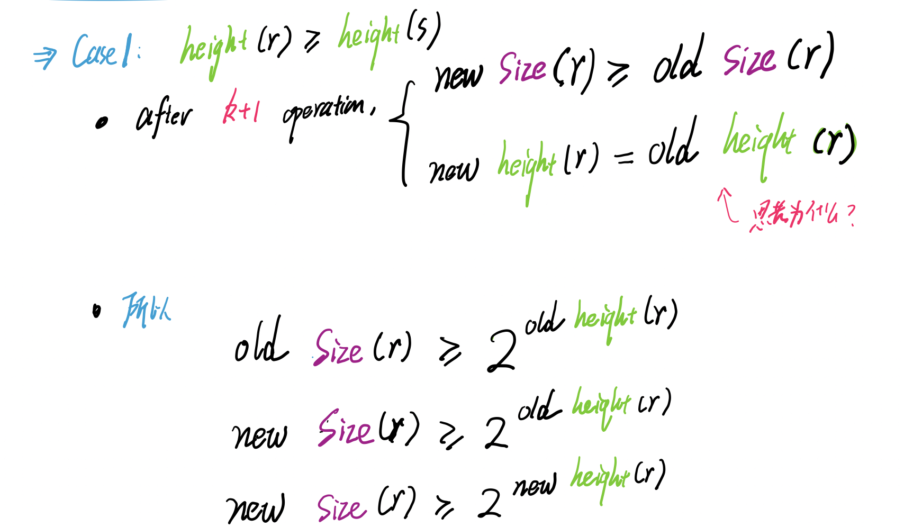
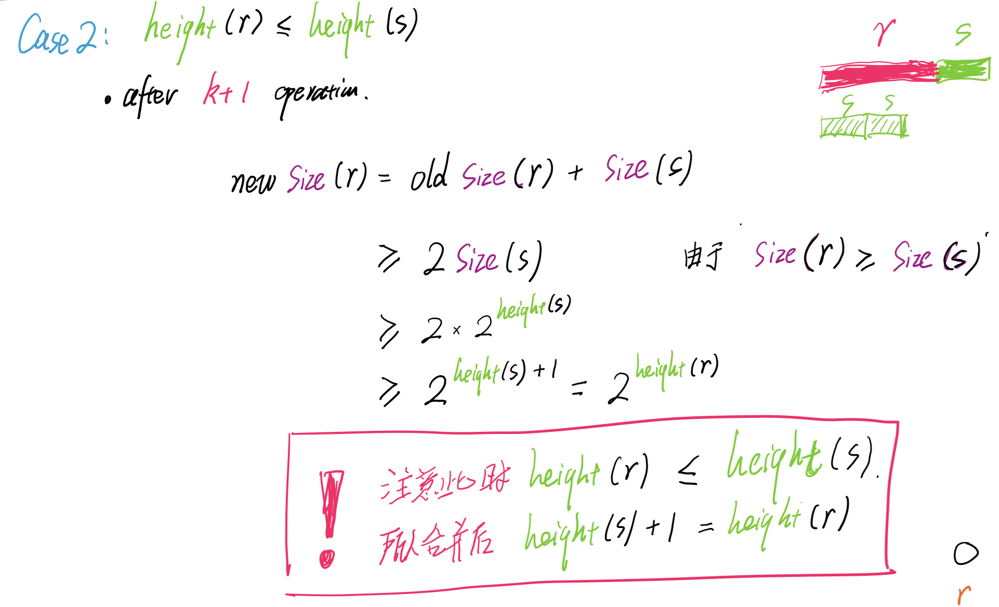
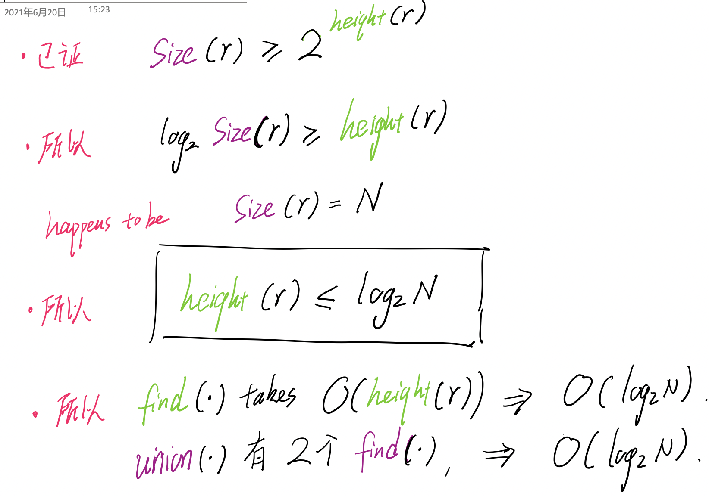
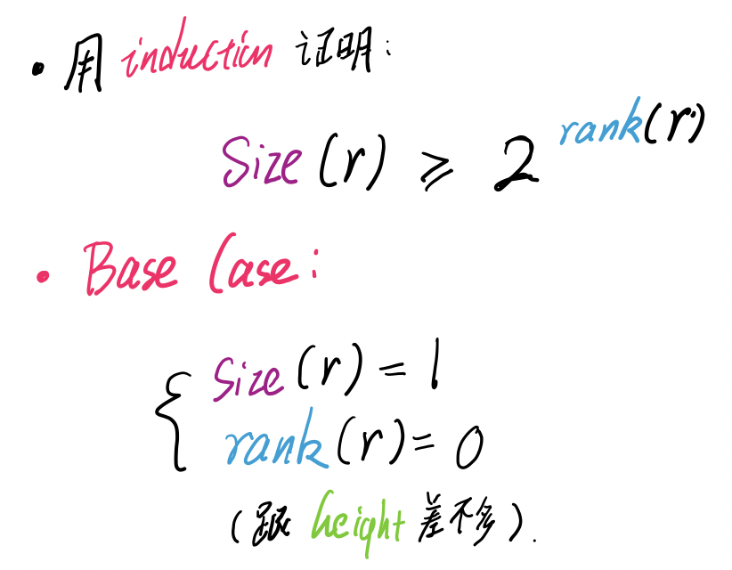
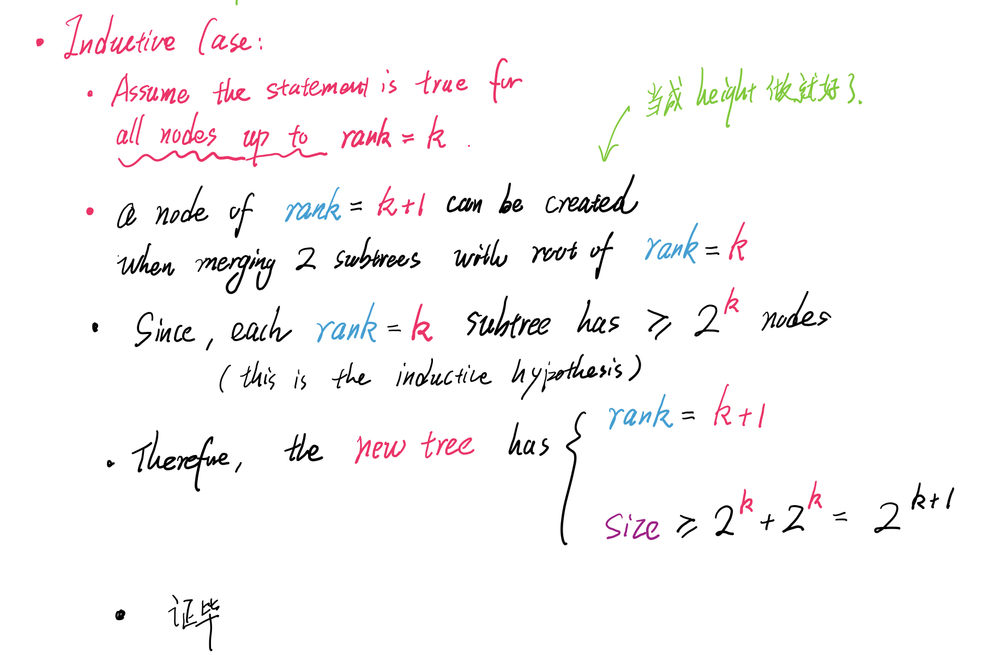
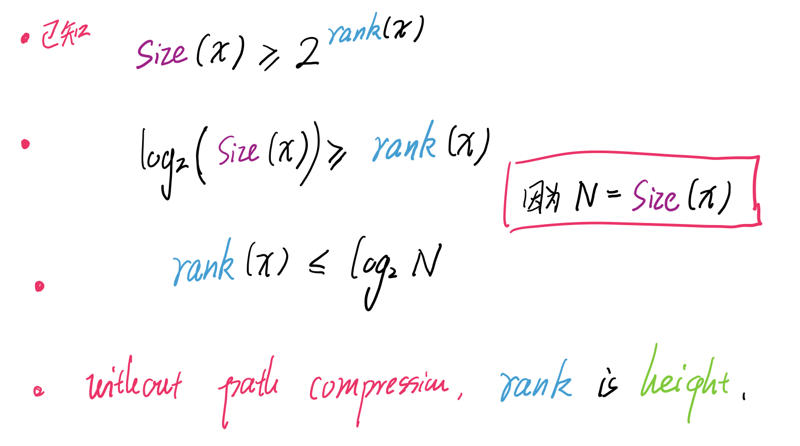

### [Home](./index.html)

# Disjoint Set 

## Path Compression

- Only change the **Parent Array** (but not the rank or height)
- Path Compreesion will generate **a different parent arary** compared to without a path compression 
- 因为 parent 的映射关系改变了
- 注意 `find()` 的压缩发生在 `union()` 之前
  - 所以 union 改变 parent 关系后， 别多

- `[-2,1,1,1,1,-3,6,9,6,-1,1] `
- find(6), find(10), union(10, 7)
  - 7 已经指向 6 了 
  - `[-2,1,1,1,1,-3,6,9,6,-1,1]`   
- `[-2,1,1,1,1,-3,6,9,6,-1,1]`   
- find(8), find(4), union(8, 4)
  - 找到 8 ，所以把 8 指向 6 
  - 找到 4 ，所以把 4 指向 1 
  - 把 1 的 rank 去掉，并指向 6 
  - `[6,1,1,1,1,-3,6,6,6,6,1]` 

## Union by Size 

## Union by Size - O(logN)

## Union by Rank 

## Union by Rank - O(logN)

