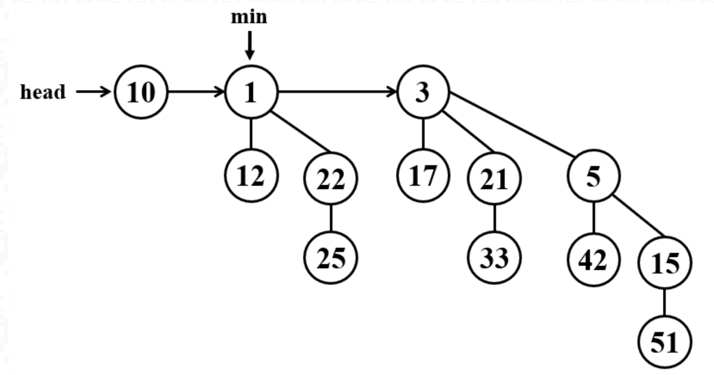
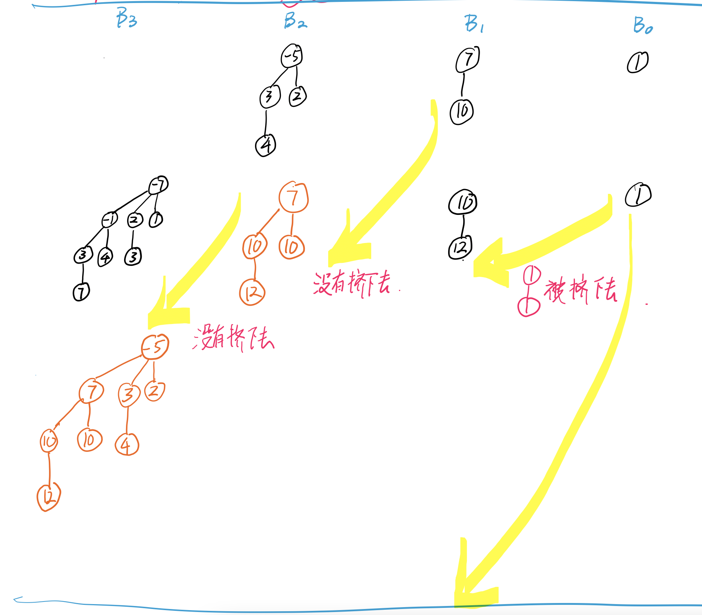
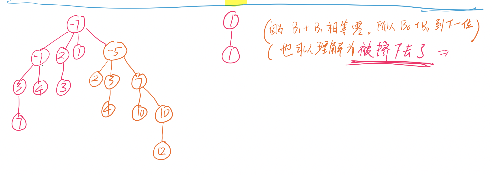
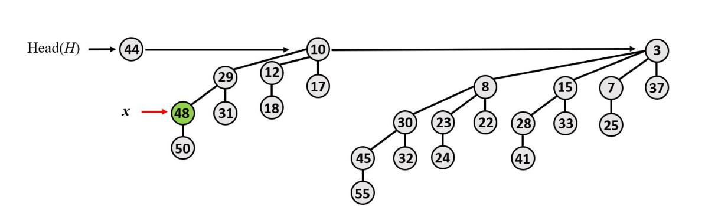
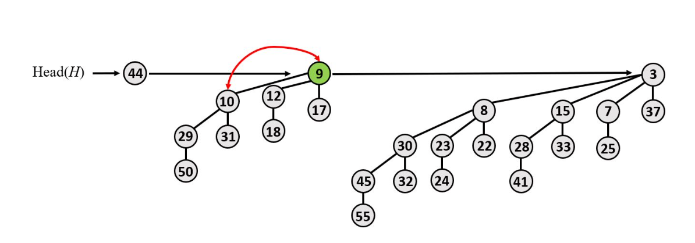
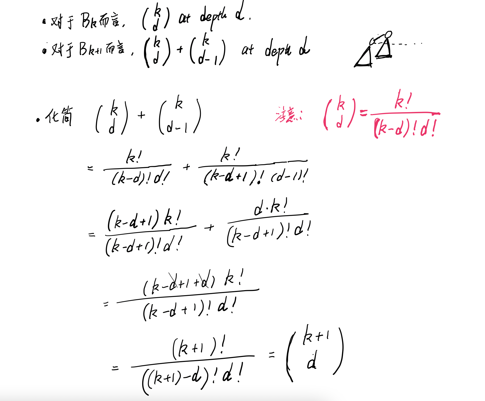
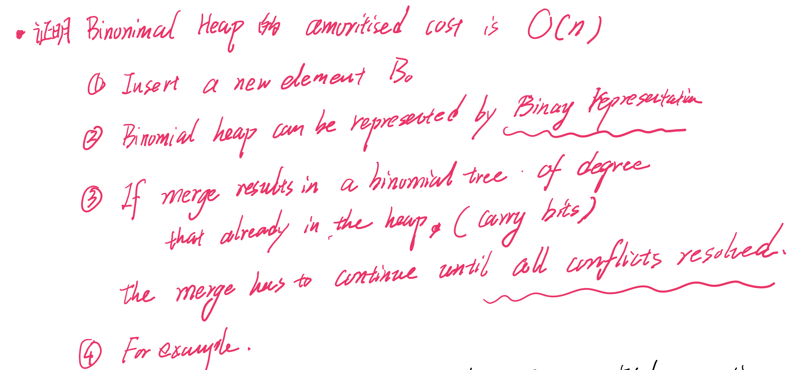
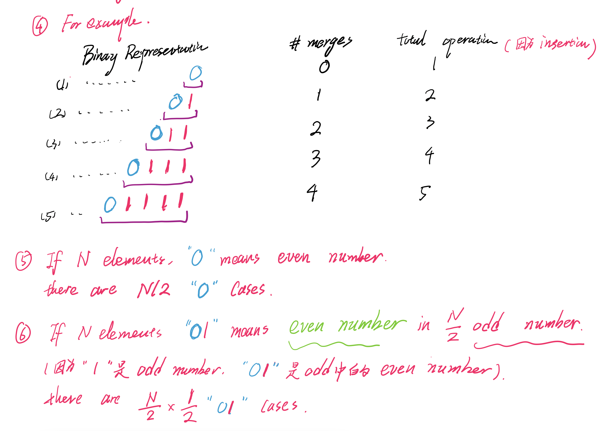
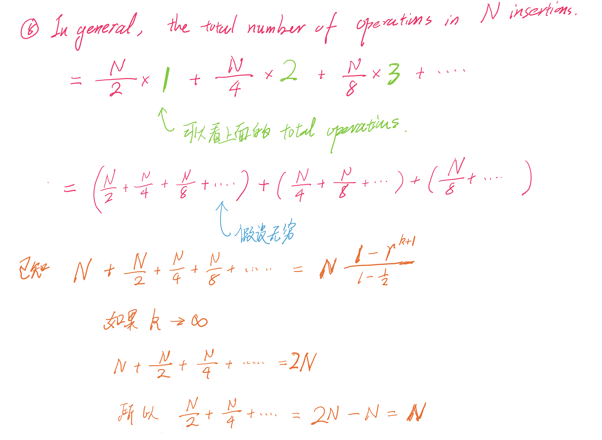
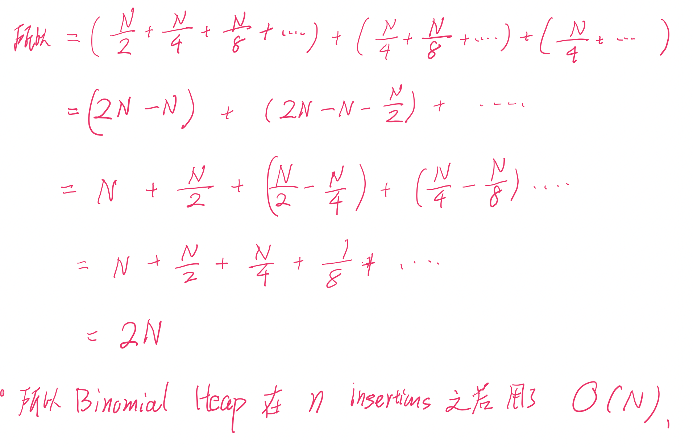

### [Home](./index.html)

# Binomial Heap 

## Insert 

- 创建一个新的 node ，然后 Merge 。

## Extract-Min 

**易错点**：

- ***Extract-Min 之后忘记了 Consolidate*** 
  - Extract-Min 之后 Promote 可能有 degree 相同的树 (所以要合并)

- 提醒：就算是 Fibonacci Heap ***, 在 Extract-min 之后也要 Consolidate 。***

- 上面是 `[10 (head), 1 (min), 3]`
- **Extract-Min 之后**
  -    [10(head), 12, 22, 3(min)]
       [10(head), 22, 3(min)]
       **[10(head), 3(min)]**

## Merge 

- 模拟**加减法**
- **进位有可能被顶下去**

## Decrease-key

修改那个 node ， 一直 bubble up 直到不违反 Heap 的规则

(即 **parent node 总是小于 child node**)

decrease key(48, 9)

## Tree Property 

- **Bk** has **2^k** node
  - **Base Case** :  k == 0
  - **Inductive Hypothesis** : k **>=** 0  
  - `B_{k+1} = B_{k} + B_{k}`
- **Bk** has height **k**  
  - **Base Case** :  k == 0
  - **Inductive Hypothesis** : k **>=** 0  
  - `B_{k+1} = B_{k} + 1`  to construct `B_{k+1}` from `B_k`  (a child of ...)
- **Bk** at depth, the number of nodes is ***k choose d*** 
  - **Base Case**: B0, B1, B2
  - **Inductive Case**:  

## Time Complexity 

