### [Home](./index.html)

# Fibonacci Heap 

## Insert 

- 把 **新的 node** 插入到 **Hmin的左边**

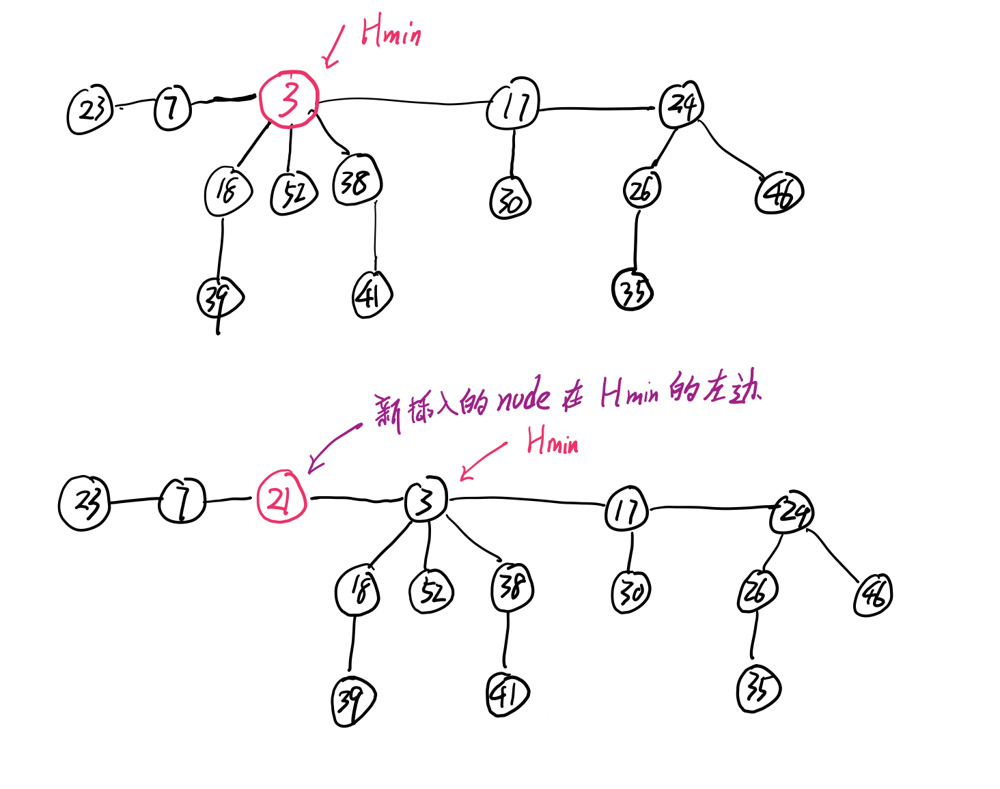

## Merge 

**更新 Hmin**,  然后连起来。 

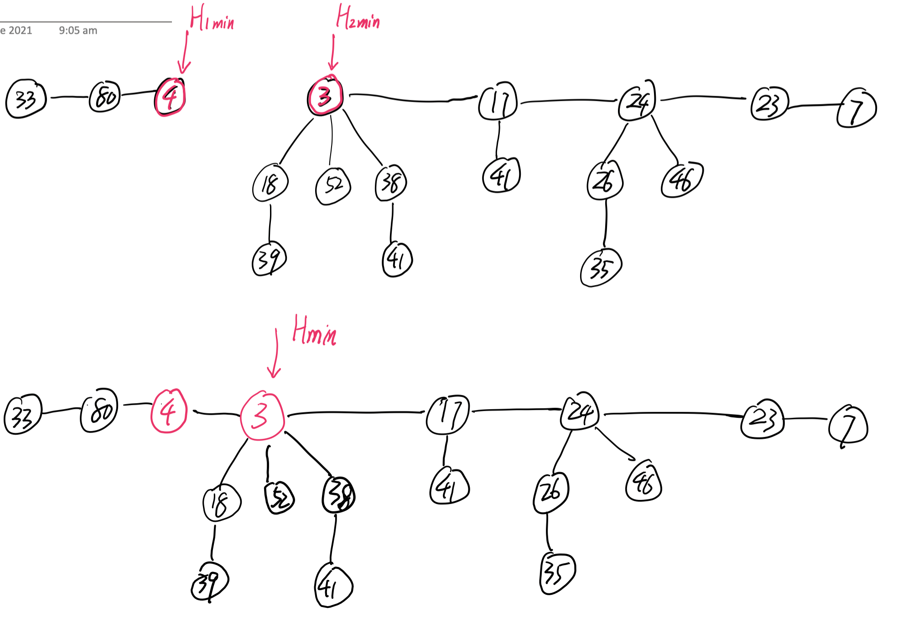

## Decrease Key

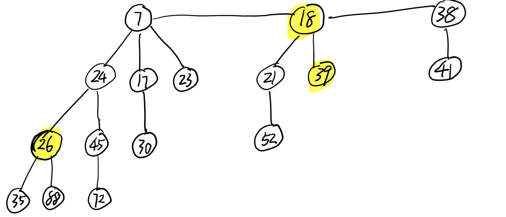

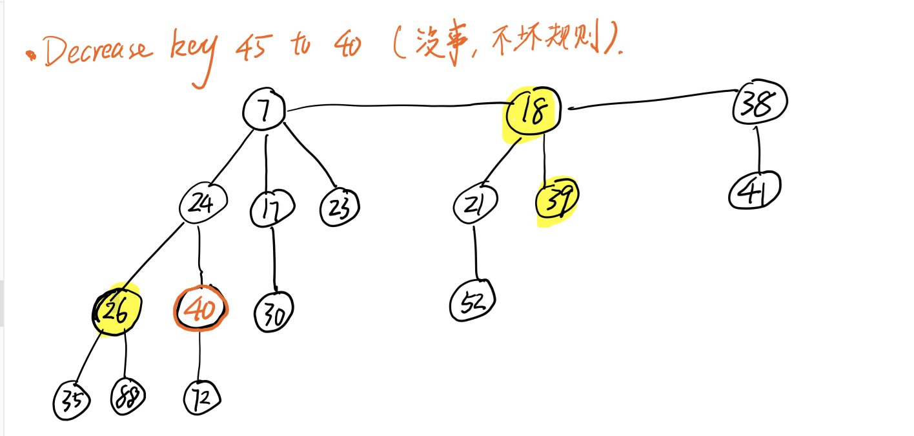

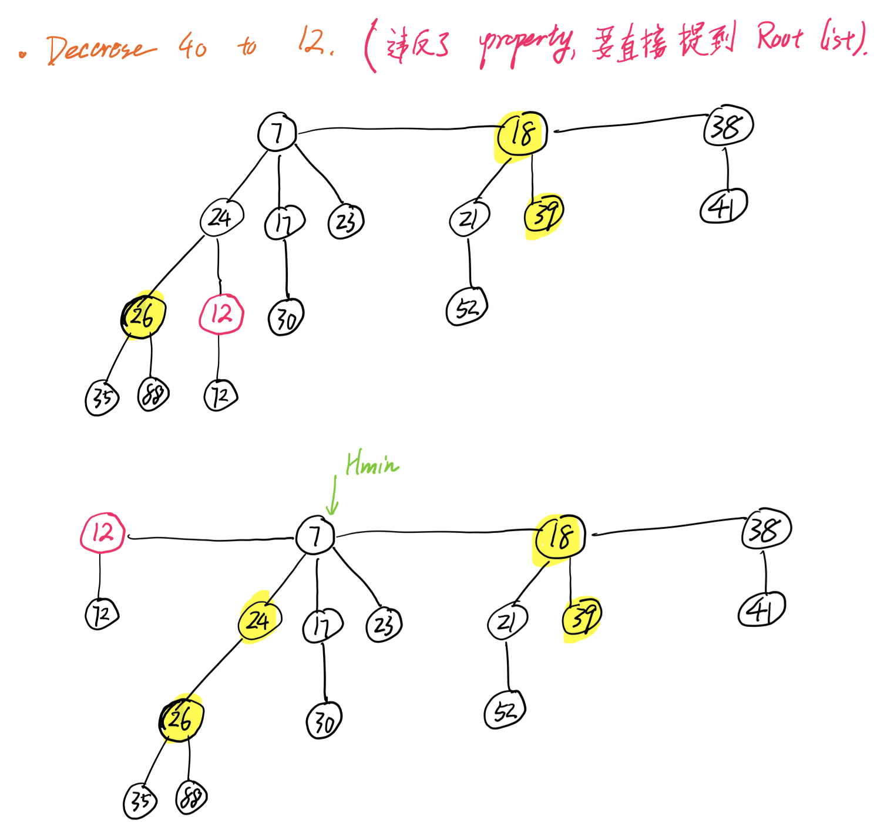

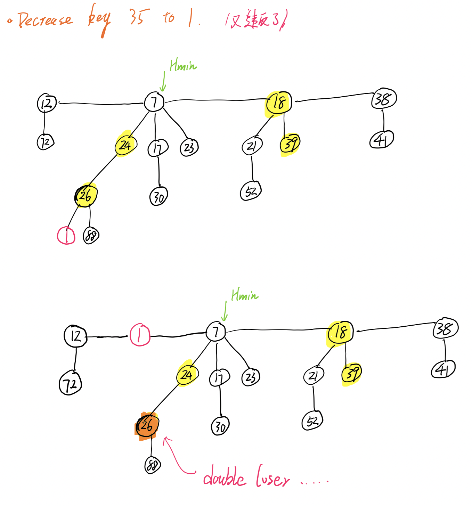

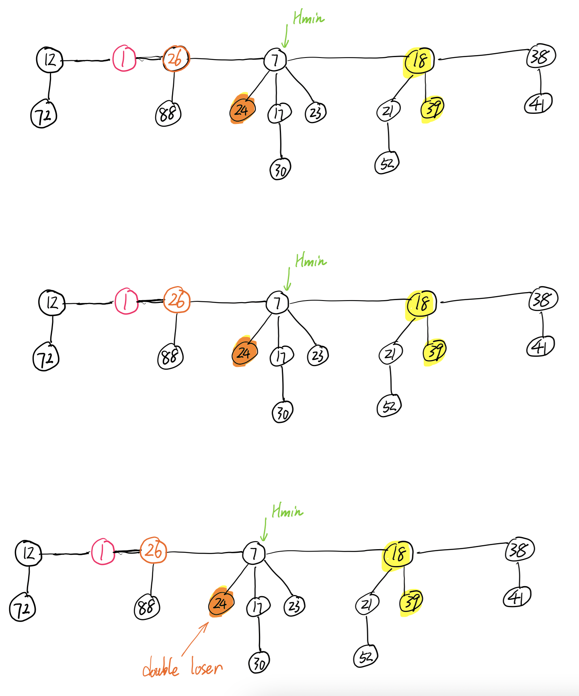

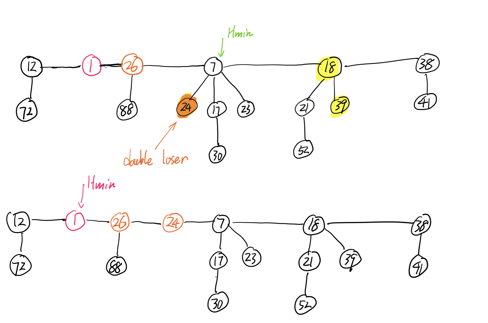

## Extract-min

- Cut 掉 Hmin 
- 然后 **promote Hmin 的 children** 
- 找到新的 Hmin 
- 让 Curr 指向 Hmin (新的 Hmin)
- 用 Auxiliary List 记录 Curr 的 degree (即 index 是 Curr 的 degree)
- Merge 相同 degree 的 tree (用 list)

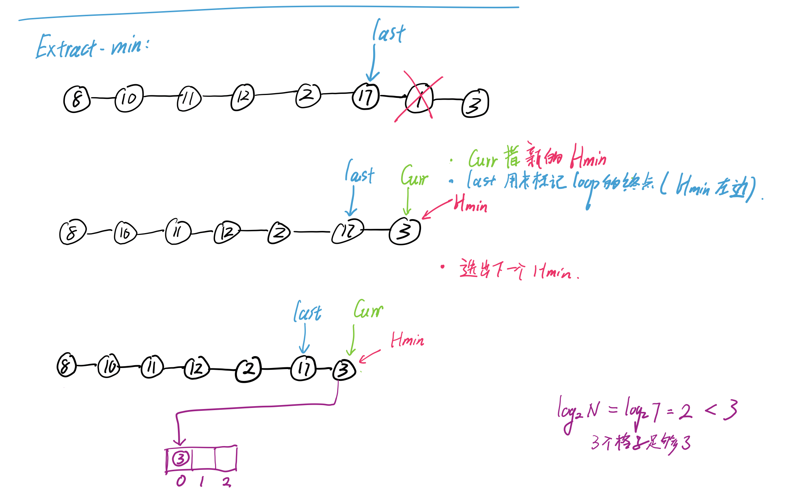

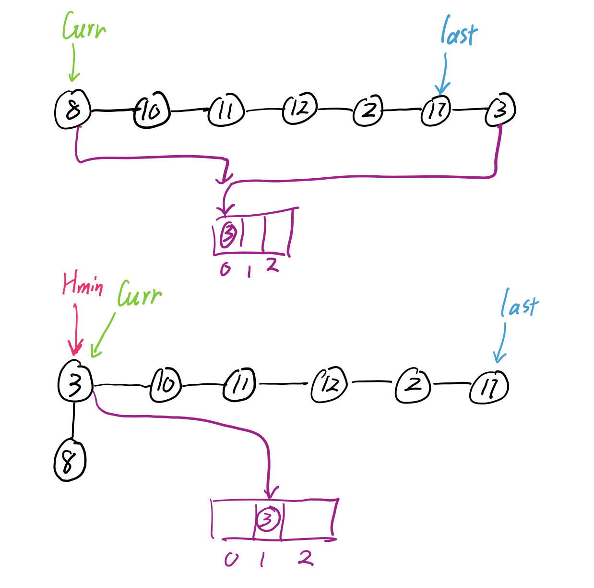

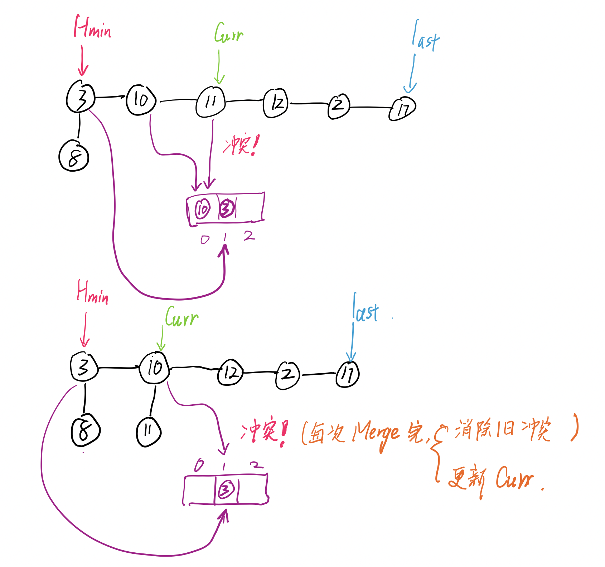

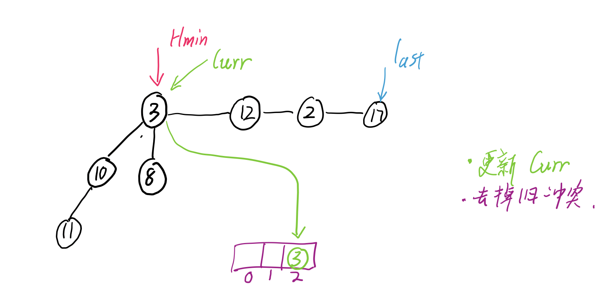

