### [Home](./index.html)

# B-tree

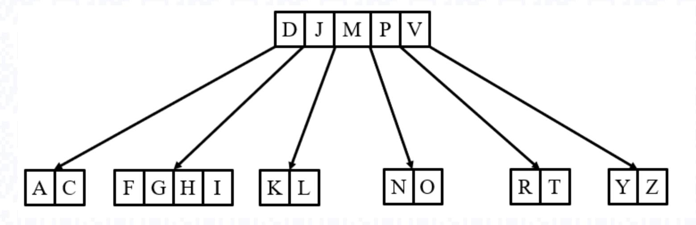

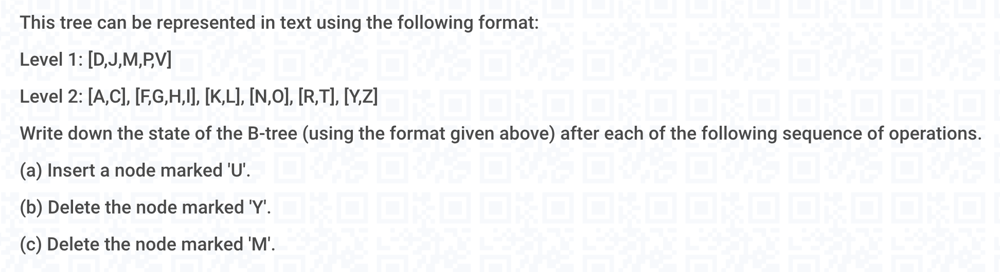

- 易错点：
  - 操作是**连续的**
- (a) 后是

Level 1: [D,J,M,P,V]
Level 2: [A,C], [F,G,H,I], [K,L], [N,O], [R,T,**U**], [Y,Z]

- 所以 (b) 开始的状态是(**有一个新的 U**)

Level 1: [D,J,M,P,V]
Level 2: [A,C], [F,G,H,I], [K,L], [N,O], [R,T,**U**], [Y,Z]

- 由于 (b) 不能 step down ， 所以 Case 3 
  - 由于 left sibling 有多的， 可以 Rotate (**左大右小**原则）

Level 1: [D,J,M,P,**U**]
Level 2: [A,C], [F,G,H,I], [K,L], [N,O], [R,T,], [**V**,Y,Z]

然后可以下去了，就用 Case 1 删掉

Level 1: [D,J,M,P,**U**]
Level 2: [A,C], [F,G,H,I], [K,L], [N,O], [R,T,], [**V**,Z]

- (c) 的状态也是上面的状态

Level 1: [D,J,M,P,**U**]
Level 2: [A,C], [F,G,H,I], [K,L], [N,O], [R,T,], [**V**,Z]

由于不是 bottom, 不能直接删掉。其能下去， 所以是 internal node 

由于 child 都只有 **t - 1**, 合并 child 和 parent 

Level 1: [D,J,P,**U**]
Level 2: [A,C], [F,G,H,I], [K,L,M,N,O], [R,T,], [**V**,Z]

 继续删掉 M 

Level 1: [D,J,P,**U**]
Level 2: [A,C], [F,G,H,I], [K,L,N,O], [R,T,], [**V**,Z]

## Min-Height of B-tree

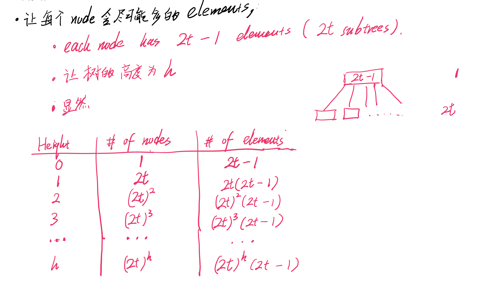

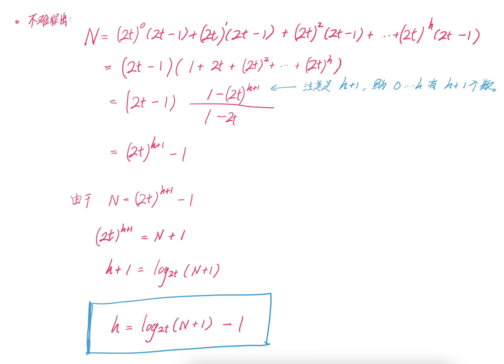

## Max-Height of B-tree

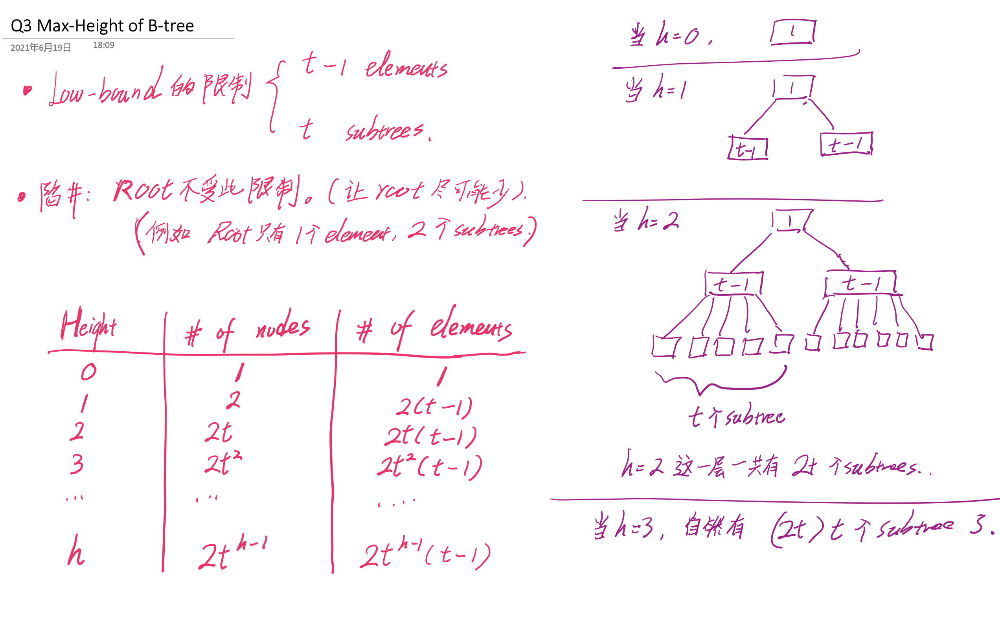

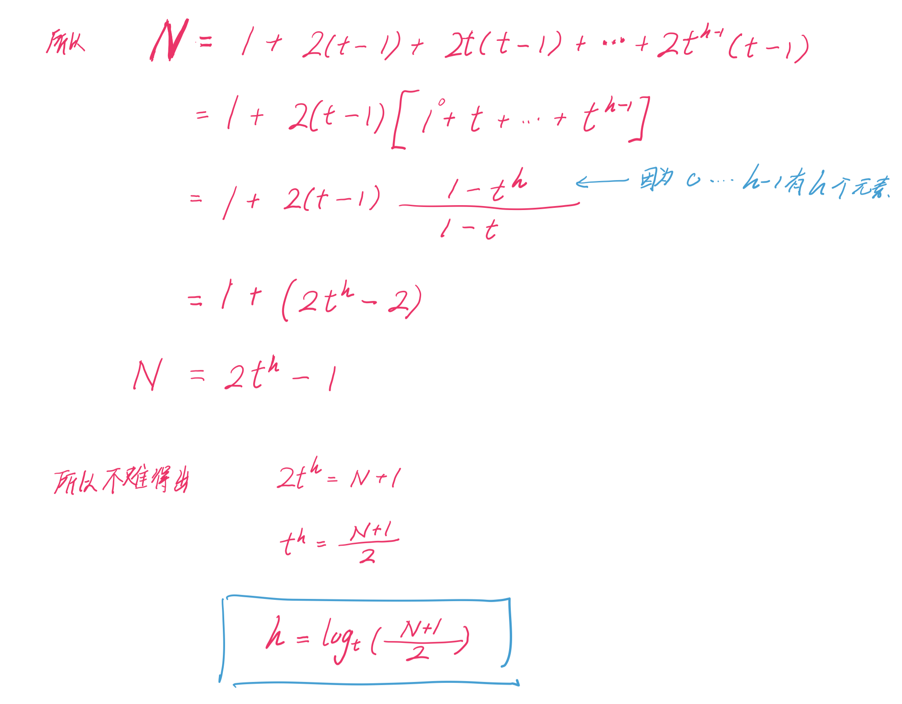

## Insert 

- 在 leave 结尾 append (意味着要***一直搜到 Bottom***)
  - 如果满了， 把 leaf node 从 median 开始分离
  - 把 median 移动到 parent node 里面 

## Search 

- 每看到一个满了的 node , 都要将其分离(split)
  - lower bound : `t - 1`
  - upper bound : `2t - 1`

## Delete 

- Case 1 
  - **x** 在 Bottom layer 里面有且只有 **t** elements
  - (注意 Case 2, 3 都是把 node 挪到 bottom layer, 只有 Case 真的删东西) 
- **左大右小** (如果 left child/sibling 就用最大的)
  - 刚好是从中间开始， 两边的第一个元素
- Case 2
  - **x** 在 internal node (必须有 **t elements**, 否则是进不去这个 node, 即使是 internal 也要 Case 3)
  - **Case 2a**: 如果 left child 有至少 **t** elments, 
    - 从 left child 借一个
  - **Case 2b**: 如果 right child 有至少 **t** elements 
    - 从 right child 借一个
  - **Case 2c**: 如果 left, right child 都只有 **t -1** elments 
    - 将 x 和 两个child 合并 (把 x 往下拉)
    - 调用 recursively delete 删掉底部的
- Case 3 
  - 在**到达 x 之前** (***包括含有 x 的那一层***)， 如果见到某层的**只有 t - 1 elments** 
  - 下不去， 要补全这一层
  - **Case 3a**:  如果此 subtree 的相邻 sibling 有 **t elements** 
    - 通过 Rotate 借 elements 
    - 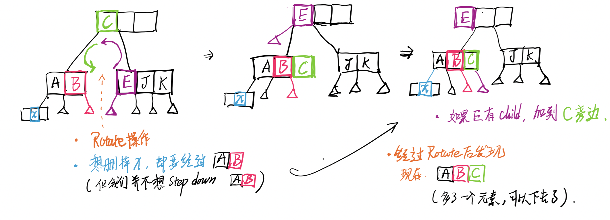
    - 如果被旋转的元素 E 下面有 subtree， 直接加到 C 的
  - **Case 2b** : 如果此 subtree 的 siblings 只有 **t - 1 elments** 
    - 把 **两个 siblings** 和 **两个siblings的 parent** 合并 
    - 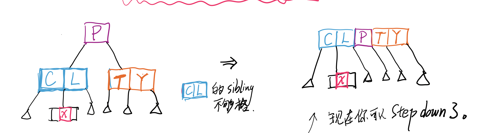

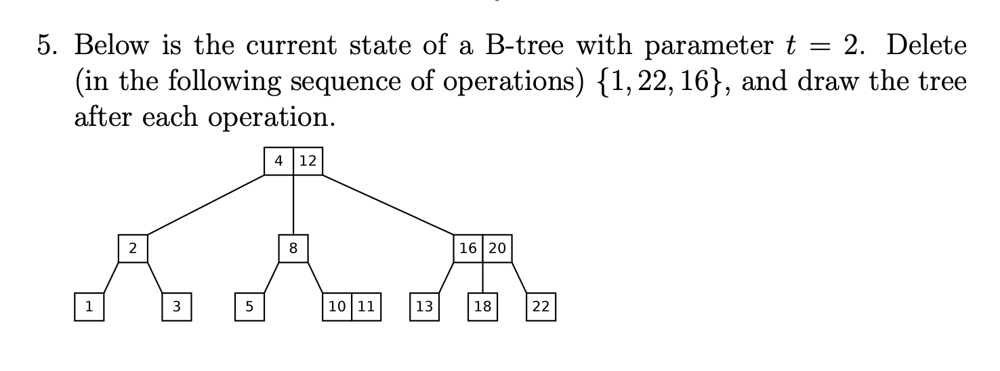

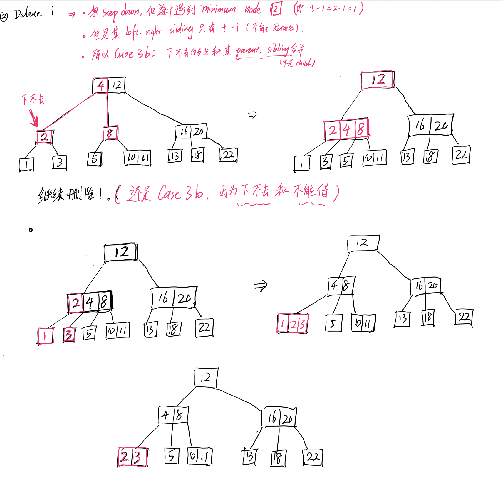

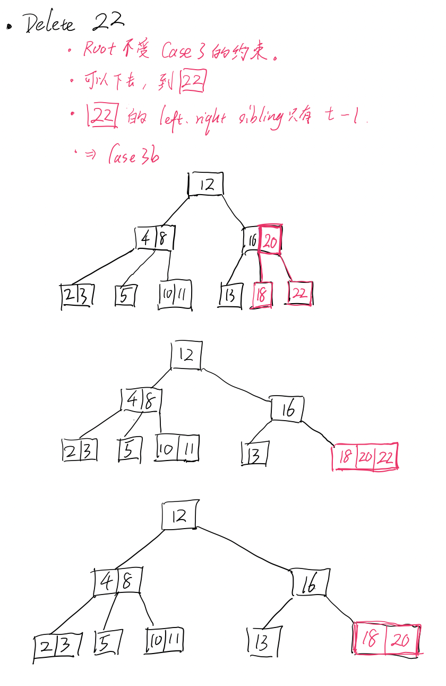

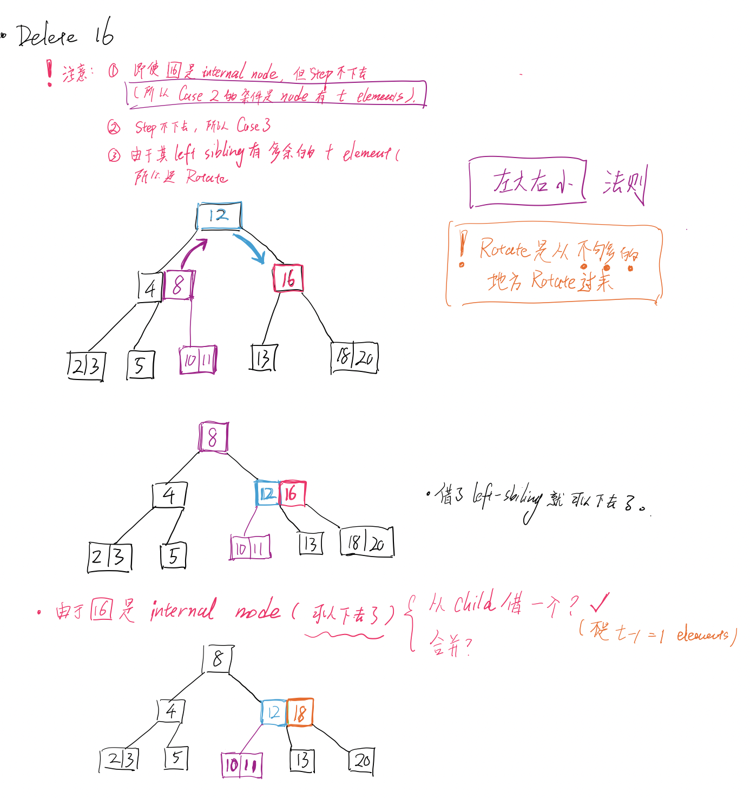

