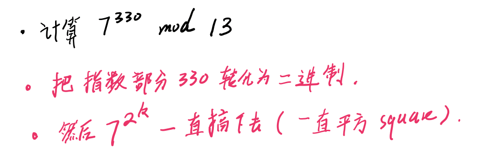
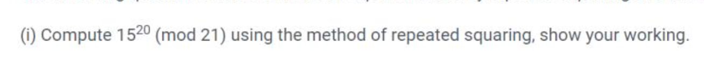
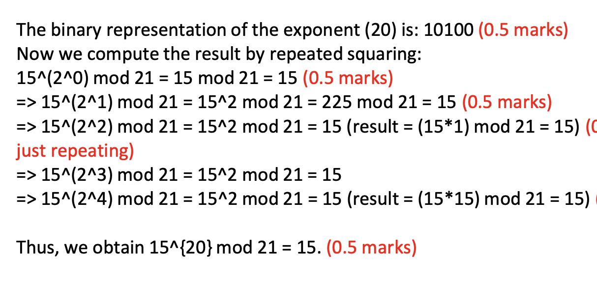
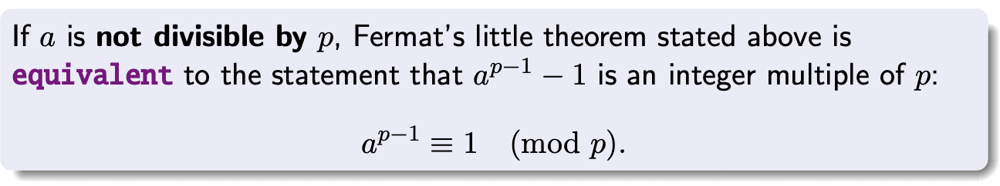
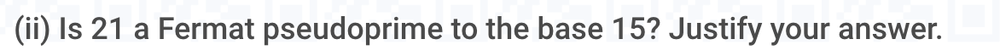
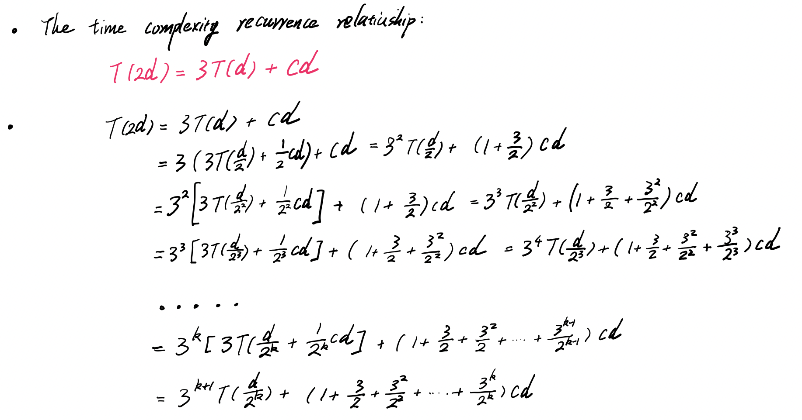
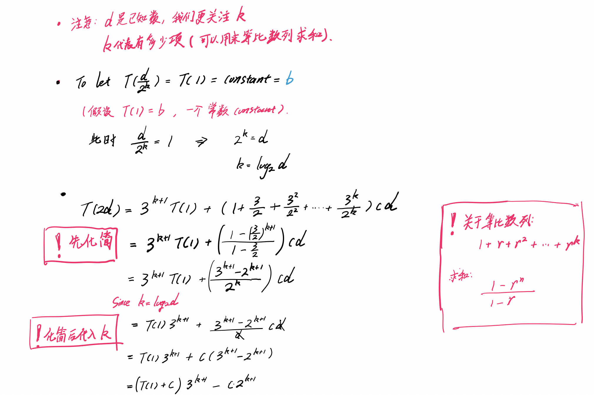
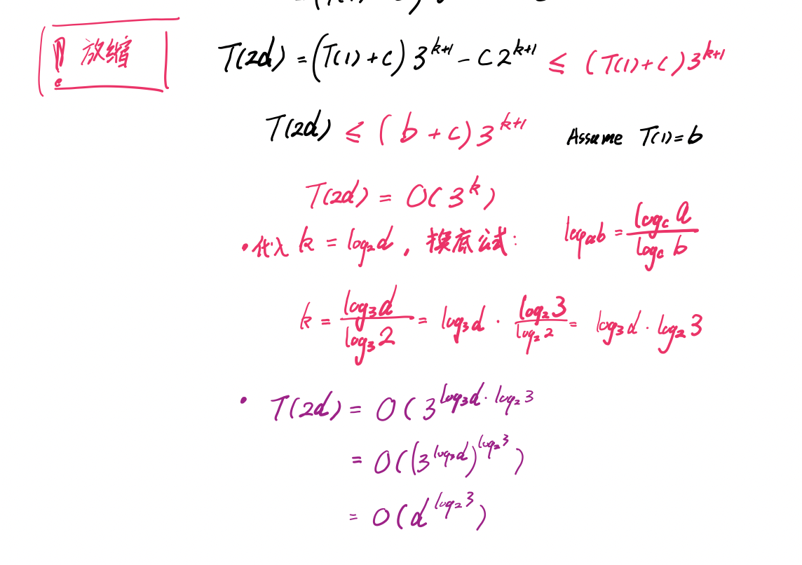

### [Home](./index.html)

# Semi-numerical algorithms

## Repeated Squaring 

- 一直**将前面的结果平方**。 
- 然后**取需要的 x^{2^k}**  (二进制数位)

- 此处取 k = 2 和 k = 4 ，因为 2， 4 的二进制都是 1 。 
  - （15 * 15） mod  21 = 15 

## Fermat’s little theorem

- a = 15 
- p = 21 
- 即 15^{20} mode 21 = 1 才是 pseudoprime 

## Miller-Rabin Test

- Fermat’s little theorem
  - `a^{n-1} = 1 (mod n)`
- 但是 `n - 1 = 2^{s} t`
  - 用二进制更容易分离
  -  所以可以 `a^{2^{s} * t} = 1 (mod n)` 来执行最终的 Fermat’s little theorem
- 但是 Miller Rabin 多了 **Sequence test**
  - 在计算 `a^{2^{s} * t}` 的过程中，  
  - 会有.    `0 < i < s`
    - 如果 `a^{2^{i} * t} mod n = 1`
      - 那么 `a^{2^{s} * t} mod n = 1` 或者 `a^{2^{s} * t} mod n = n - 1 `
      - 所以   `a^{2^{s} * t} mod n != 1` 和 `a^{2^{s} * t} mod n != n - 1 ` 就意味着一定是 composite number 
      - (上一个 sequence 也能通过 Fermat 定理， 所以 应该是 **+1**， **-1**)
      - 不过 -1 在此处是 **n -1** 
      - 如果上一个 sequence 不通过 Fermat 定理， 那么一定是 Composite Number 

## Recurrence 

