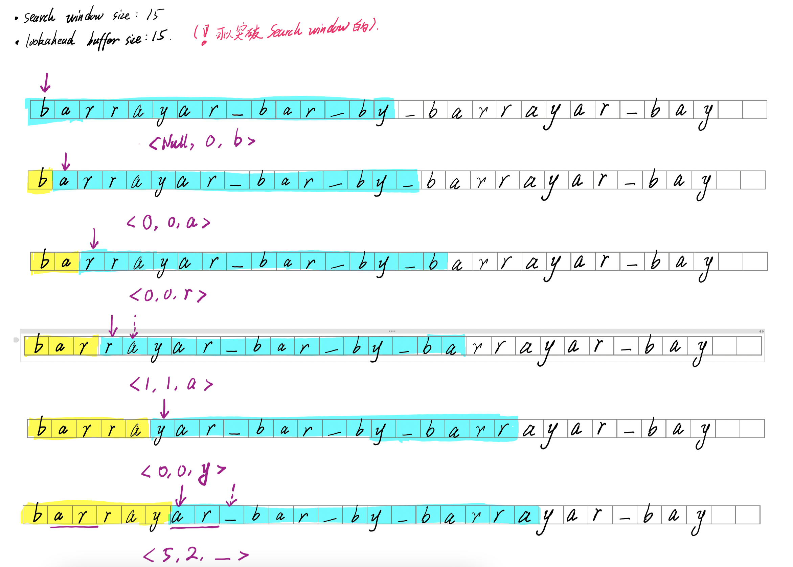
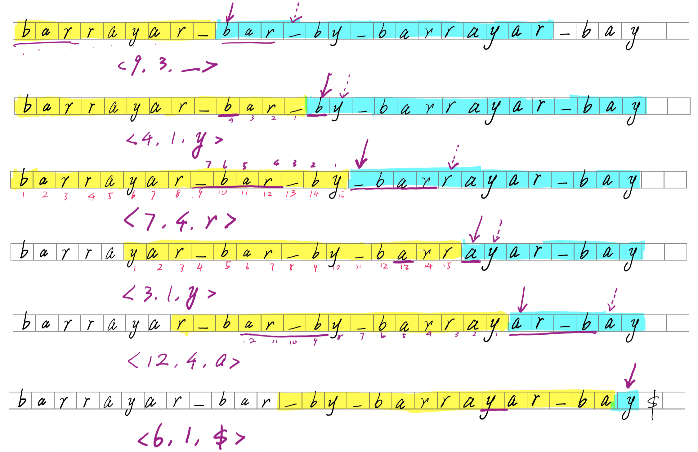
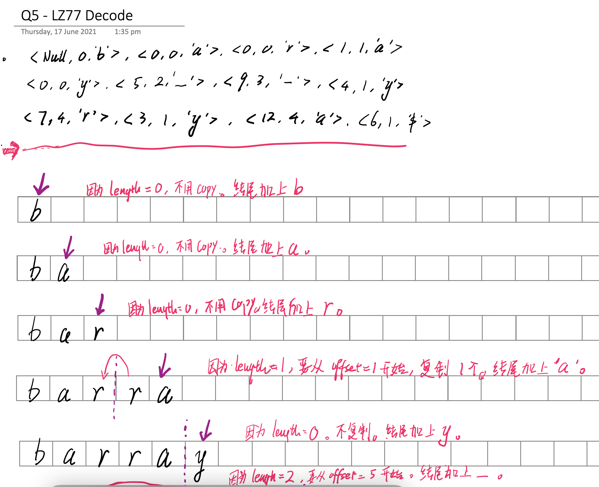
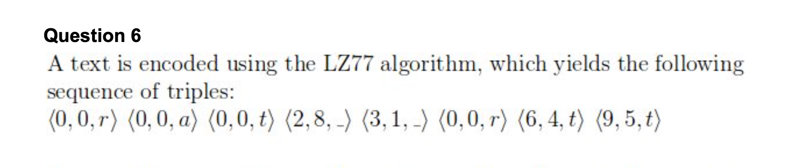
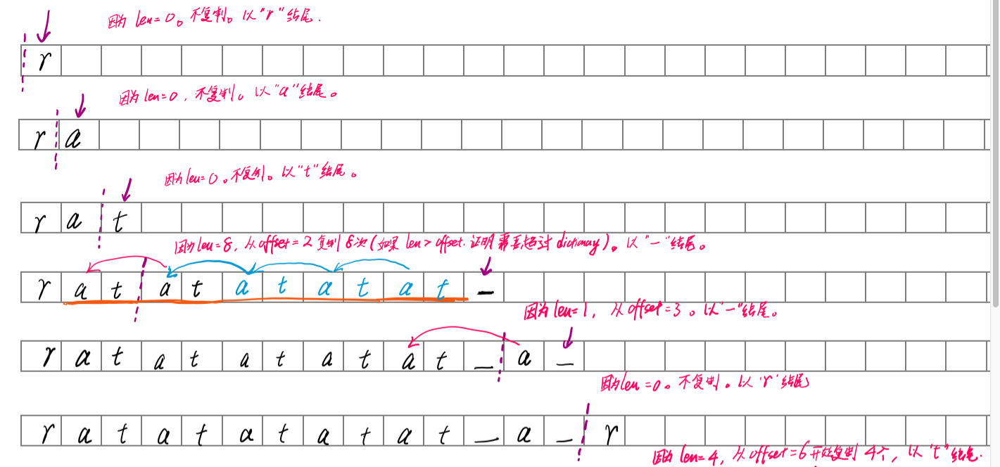

### [Home](./index.html)

# Data compression

## Huffman Code 

- 要求 **Prefix-free** 
  - 要详细指出是哪个没有 prefix 
  - ***一个字母的整个 code 都是另一个字母的code 的 prefix*** 
- **Huffman tree** 
  - Huffman tree is a binary tree with characters at the bottom 
  - ***each character has path from root to leaf*** 
  - If not prefix-free, the path should end at the half-way, e.g. an internal node (如果不是 prefix-free, 就会中途停下)
- 易错点：
  - 注意是**每次都将频率最少的两个合并**。

## Elias Encoding

- N : 普通二进制
- Length : **减一**并**转换为二进制**
- 把 Length 的二进制的首位改为 0 ， 并当成普通整数,  继续将其长度**减一**， 再转换二进制

## Elias Decoding

- **加一**

## LZ77 

## LZ77 

