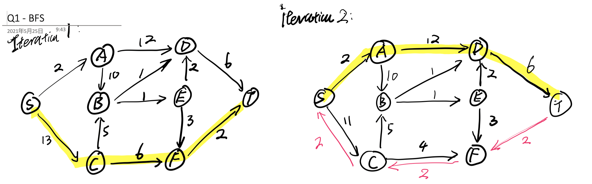
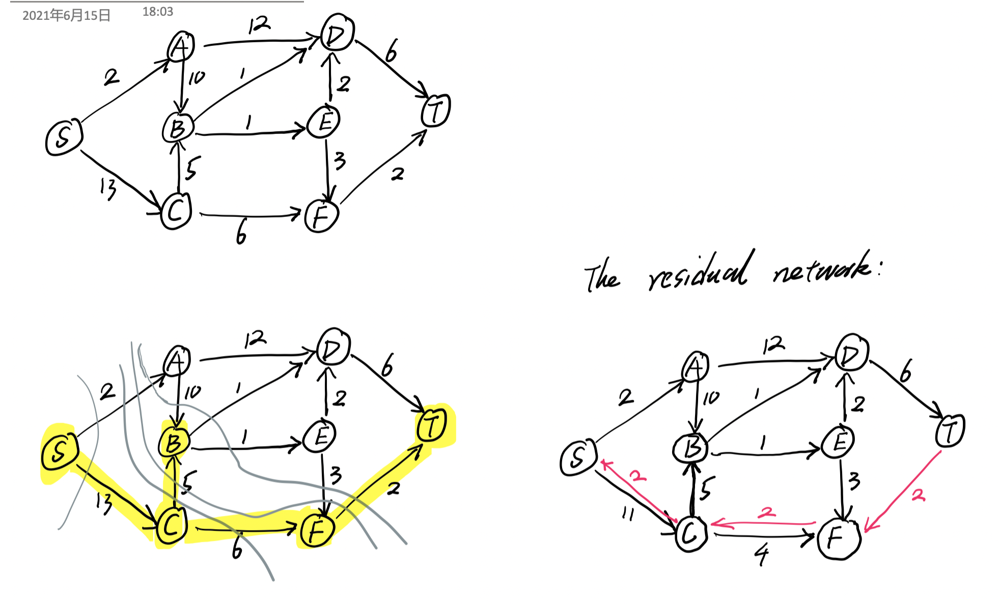
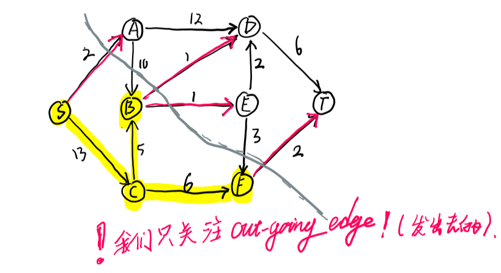
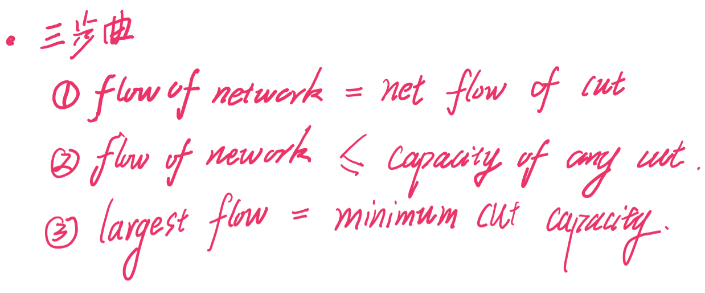
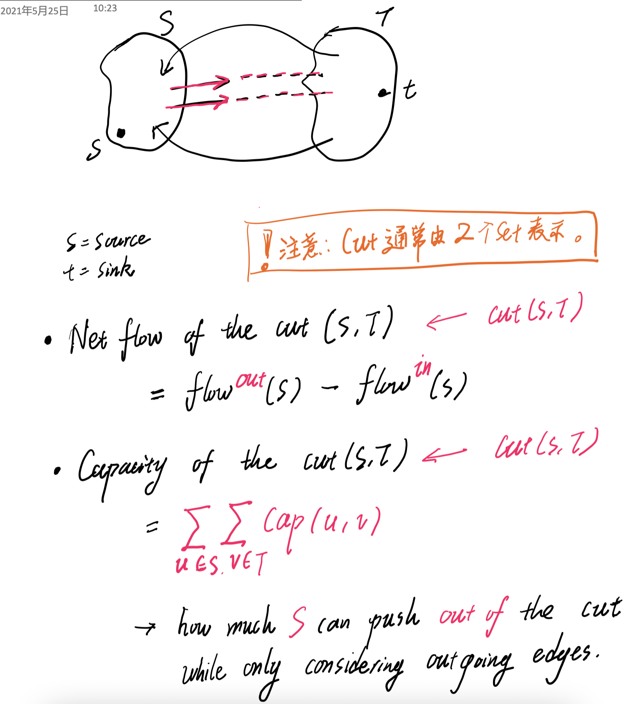
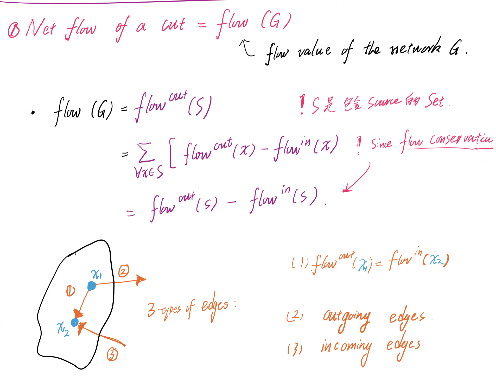
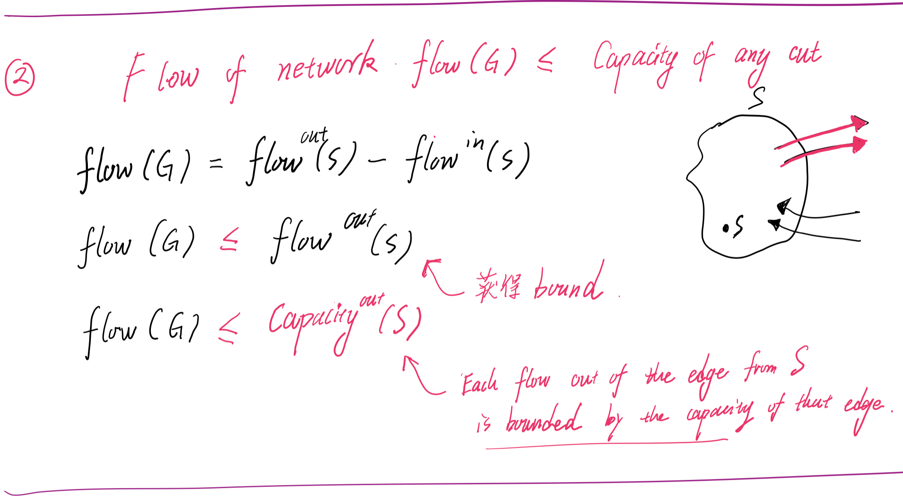
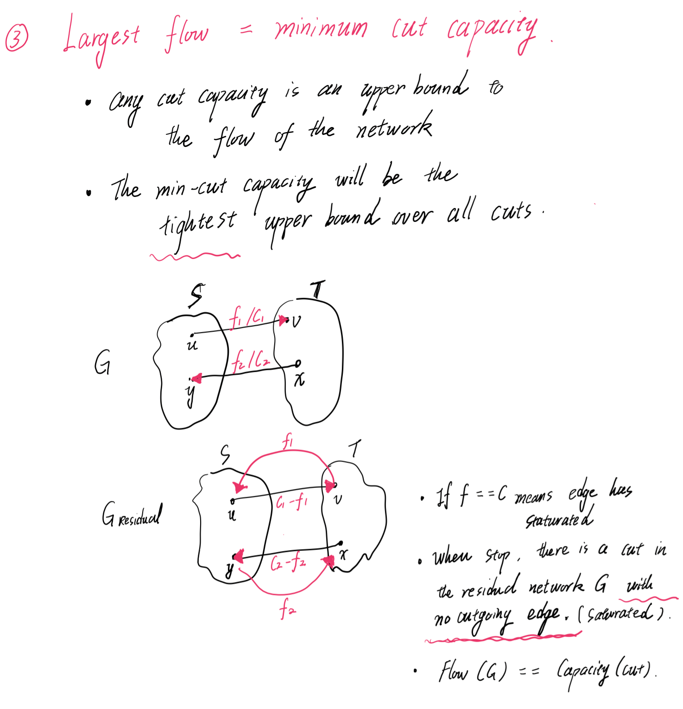

### [Home](./index.html)

# Network Flows

## Flow Property 

- Flow Capacity and Flow 
- Flow positive 
- source 只有 outgoing 
- sink 只有 incoming 
- Flow conservation (每个 node 都要查)

## Ford and Fulkerson

- Residual Network 
- Augmenting Paths 
- Cut 

## DFS 

- Find the shortest path in the residual network (ignore the weight of edge)
- 最短路径 (和 edge capacity 无关)

## Bottleneck 

- Use **S** and **T** set 
  - Use the edge with **hightest maximum capacity** in **S** 
  - **易错点**： 我们只关心 residual network 的 outgoing edge 。
  - 刚开始 **S 只有 s**  ， 其被 cut 的 edge 有 2, 13 。选 13 
  - 然后此时 **S 有 s, c**  。其被 cut 的 edge 有 2, 5, 6 。 选 6 。 
  - 直到**到达 t 为止**

只**关心 outgoing edge** 

## Max Flow and Residual Network 

(iii) Suppose now that our flow network is at maximum flow. Argue that in this case the corresponding residual network cannot contain an augmenting path.

Part (iii)
 Solution:

- Assume that while we are at maximum flow there is an augmenting path P in the residual network. 
- If the minimum capacity of an edge in P is c (c > 0 as it is a capacity) (0.5 marks for stating c > 0), 
- we can augment the flow out of the source by c in the original network (1 mark). 
- This would in turn increase the flow of the network by c, which contradicts the fact that we were at maximum flow! (1 mark) 
- Thus, P cannot exist in the residual network and when we are at maximum flow the residual network cannot contain an augmenting path. (0.5 marks)

## Min-cut Max-flow theorem

