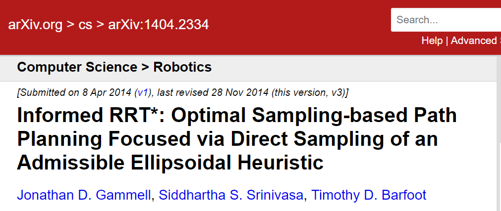
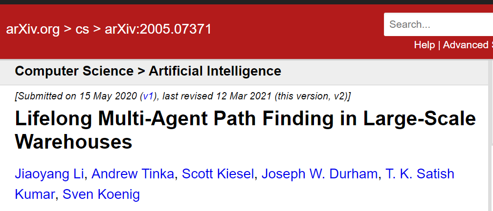

## 职业发展

### 技能

- C++, Python, Haskell 
	- C++, Python 是因为 ROS 
	- Haskell 是因为 Rust 

### 研究兴趣

- Robotics 
- Motion Planning, Kinodynamic Motion Planning 
- Multi-agent path planning
- Control theory [学习运动规划该看什么书 - 知乎 (zhihu.com)](https://zhuanlan.zhihu.com/p/44040710)

### 不要分心

你只能关注 arXiv 的 Computer Science -> **Artificial Intelligence** 和 **Robotics** 

因为你将来只研究 Motion Planning, Kinodynamic Motion Planning, Multi-agent path planning, control theory 这几大问题， 其他都稍微达到本科水平即可。

### 建议岗位

只要 C++ 开发都可以。为 ROS 积累原始资本。