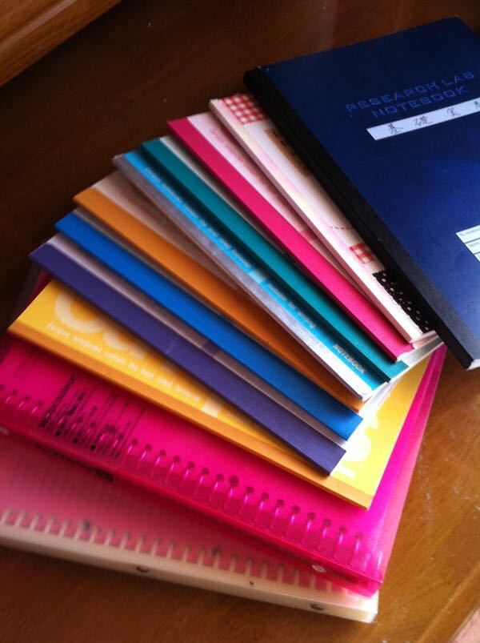
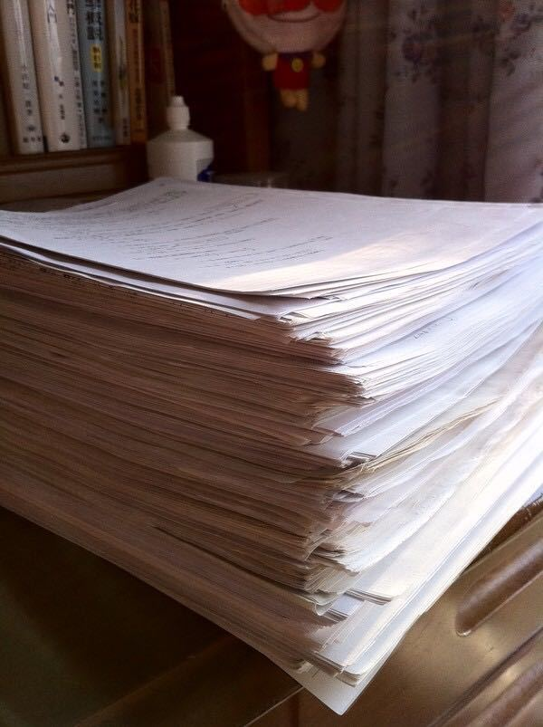
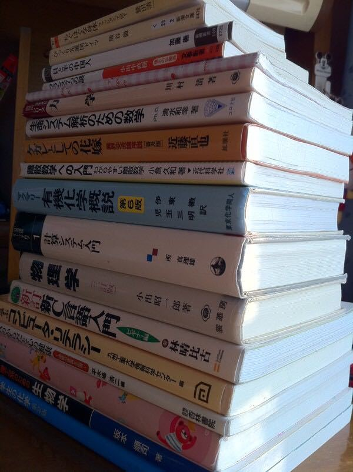
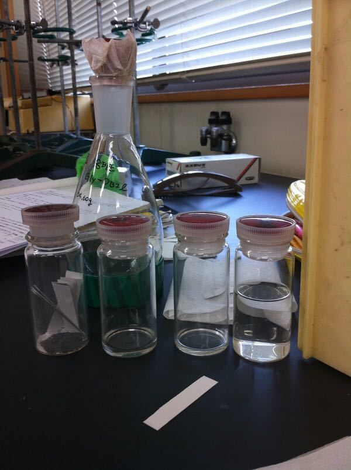
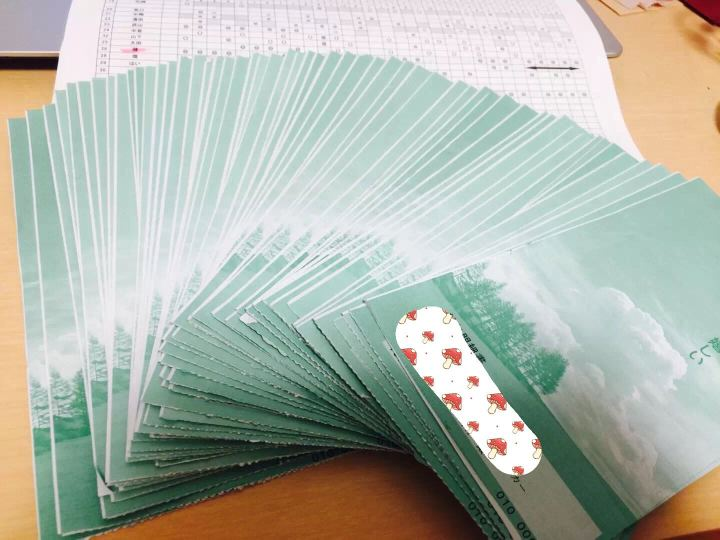

> [龙樱](https://movie.douban.com/review/3739169/)："这是你的人生”， 要靠自己的努力。"
>
> [Redjuice 的**一万小时理论**](https://zhuanlan.zhihu.com/p/29927603) 。 [罪恶王冠]()
>
> [nicoten「ふわふわ」](https://www.youtube.com/watch?v=PdjceuLg8Tc) **三日坊主は駄目です**。
>
> [**時間という財産**: Hidetaka Nagaoka at TEDxSaku - 时间是财产](https://www.youtube.com/watch?v=EzXvih454dM)
>
> 28法则 (了解本质、核心 ， 因为时间有限)
>
> ***如果连简单的事情都做不好，怎么能做复杂的事情呢？*** 第一步都是以简单的事情为目标。
>
> 生活中总有不顺心的事， 不值得放在心上。多想一想自己的技能是什么,  是不是还有更加意义的事情要做？

|  **[Chin](https://www.zhihu.com/people/chen-cun-cun)** 陳さん: 意志のあるところに、道は開ける。 |
| ------------------------------------------------------------ |
| 日本某大手企业员工(System Engineer), 日本某国立大学 Bioinformatics 专业. |

[人生规划 - 机器人学、运动规划](https://ran.moe/shared/pdf/my_way/)

[Jiang Ren 的C++面试笔记](https://ran.moe/2021/05/08/jr.html)

---

不是学霸，只能说是从一个学渣变成一个比较努力的人吧。

高考本科没考上，为了以后的前途，选择了来日本留学。在日本上了一年半的语言学校，在校期间一边学日语一边备战日本国立大学。当时脑子里只有两个概念，**考不上国立进私立的话我交不起学费和高考失败的沉痛打击让我害怕再次失败，所以就抱着进不了国立只能滚蛋回国的压力，夜以继日地学习，学校关门就跑到麦当劳里面学习，好多时候都是凌晨2，3点才睡觉。**可能由于压力和睡眠不好，体验过好几次鬼压床。。。最终得到了上帝的眷顾成功进入了国立大学。

大一、大二无休止的必修课从早到晚几乎没有间歇过，晚上打工到10点，周六周日也是一整天一整天的打。

大一一年记得笔记和看过的资料。

大一时候的教科书，当时学了不到两年的日语，不管是听课还是看资料都相当的费劲。写实验报告就更不用说了。

顺便发几张实验课的情景，实验课其实是最头疼的，好多化学器材的名字，各种专业术语弄得头很大，老师的指示开始根本听不懂。给小组里面的日本同学添了不少麻烦。

大三我人生中最痛苦的一年。虽然课不多但却很要命，因为有实验课，报告和发表一直没间断过。最要命的是，那年家里经济状况不好，学费生活费都得自己赚，所以每天早上5点起来，6点到10点去餐厅打工，打完工回家一边吃饭团一边预习实验课。接着就去学校做一下午的实验，做完实验连吃东西的时间都没有就跑去打超市收银台的工了，从晚上6点到10点。打完后回家接着写报告，几乎每天都是凌晨1点睡觉。就这样学习和打工两者兼顾的苦逼生活坚持了半年，每天平均只睡4个小时，有时候一天就吃一两个饭团 。最终在学科实验发表中得了优秀奖，当时我们学科82个人，5个人得了优秀奖，我就是其中之一。

最长的一份工作，打了整整五年，这是工资单，一张是一个月，一份工作花费了4000多个小时。。有时候真的羡慕国内的大学生，有着多我4，5000个小时的大学生活。

接着就进入了大四找工作阶段，没什么资格证书，英语也是一团糟（因为是留学生所以日企还是比较看重英语的），因为打工也没有实习经验、个人项目、社团活动(组织者)，找工作到处碰壁。最最向往的占全球前100强的某知名企业变的可望不可及，连尝试的勇气都没有。就这样大四的就职生活让我认清了现实，也是人生中的一段低谷期。决定读研，再深造自己。

读研期间，研究，打工，英语，考资格证就成了我生活的全部。每天早上起来的第一时间就是放英语听力，上学的路上，打工休息时间，上课中，都是英语，各种电影也是选英语来看。一年下来，托业提高290分，拿到了740分，和国内的人比这分数虽然算不上什么，但是自己很是挺满意的，毕竟底子太薄弱。程序员考试花了150个小时结果没合格，又拿出来50个小时备战oracle java银牌，成功拿下。为了提升自己，还参加了toastmasters club。

就这样努力了一年，重新鼓起勇气参加就职活动，日本企业招人的一般流程：笔试 -> 小组讨论或是集团面试 -> 一次面试 -> 最终面试。就是说要合格一个企业差不多要有三轮面试，都过了才能拿到offer。一直抱着进xx企业的想法参加了学校的推荐选拔，应募的人有10个人左右，最后要了3个，这次没那么幸运，没有拿到学校推荐。进xx企业百分之九十是走学校推荐的，也就是说我走自由应募的话，过的机率渺茫到根本没有希望。那也要尝试，不想放弃，就这样坐飞机去东京就为了参加它的说明会。结果与人事见了面，面谈了半个小时，之后他向公司推荐让我拿学校推荐，应募他们公司。所以绕了一圈又绕回来了，拿到了学校的推荐，这样进xx企业的机率提到了百分之四十。结果结果顺利拿下它的offer。在拿到它的offer之前，还收到了NEC集团中两个子公司的offer。就职非常顺利的结束。

所以我想说，坚定了目标一定不要放弃，即使结果可能不太幸运，但是不会留下任何遗憾。

[编辑于 2015-08-20](https://www.zhihu.com/question/23539023/answer/49652780)

---

## 人不聪明怎么办？

---

| [徐沪生]()                                                   |
| ------------------------------------------------------------ |
| 2007全国青少年*信息学*奥林匹克联赛一等奖获奖名单” 江苏省东台中学，高三，*徐沪生*，290分 |

**如果你在网上搜索「NOIP 2007 全国一等奖获奖名单」**应该能在江苏省那边看到我的名字，大概是在全省第四十多名。你再往上看几个名字，会发现另一个与我同校的男生，叫孙。

那年我们班上去复试的有十来个，但一等奖的就两个，一个我 290 分，一个是孙 300 分。别的最高分就只有 120 分了。

孙的编程特别厉害，属于那种脑袋特别灵，平时不看书也总能考最高分的。当年他高二的时候就已经是一等奖了，高三的时候再次无悬念拿了一等奖。而我花了两年的时间才拿了那个一等奖。我记得当年复试的第一道题是排序，我用的快速排序法，拿了 70 分，而孙用的平衡二叉树(AVL)，100 分。第二道题是很简单但很细碎的字符串处理，我们都是满分。第三道题我用的贪心法，第四道题我好像用的弗洛伊德算法（我也记不清了），两道题加起来才得了 120 分。而孙第三题我也不记得他用了什么算法了，拿了满分。第四题他没来得及写完代码，0 分。我四道题都做了，除了第二题满分外，别的三道题算法都不够好，都是得了部分分数，总分 290 分。而他每做一题，便是最好的算法，都是满分，如果再给他一点时间，我绝对相信他第四题也能拿满分。

是的，他平时上课从不认真听讲，课后也不会太花时间做练习，老师布置的程序题他总是第一个完成，然后就在那边玩游戏，而我们另外的人还在苦思冥想。

的确，这世上真的有不怎么学习也能成绩拔尖的人，比如孙。

的确，这世上的确有很多不够聪明的人，比如我，还有我那群小伙伴们。

**人不聪明怎么办？**

**怨天尤人？在地上打滚？骂脏话？吐痰？喷口水？随地大小便？**

**干这种事情也不会变得聪明啊。人家聪明的人还是轻而易举地拿了一等奖。**

是的，这个世界是不公平的。这是谁都没办法改变的事。**我们能改变的，唯有自己。**

我拿一等奖的时候，好几个朋友都说，我拿一等奖是理所当然的。**因为这群人里，我对编程付出的心血最多**，当他们忙着数学奥赛、物理奥赛、化学奥赛同时学好几样奥赛的时候，**我一门心思地学编程**。**我把班上所有学编程的同学的参考资料一一借来（有些参考资料太贵，没舍得买），一道题一道题地做完了，能独立完成的，直接 Pass ，不能独立完成的，看答案，看了答案能理解的就理解，然后自己再重做一遍，不能理解的 —— 把整个算法和编程背下来。**

有段时间我无法理解快速排序，便把快速排序背下来了。谁知后来真派上用场了。

有段时间我无法理解弗洛伊德算法，便把弗洛伊德算法背下来了。谁知后来真派上用场了。

更多的是， 有段时间我无法理解 …… 算法，便把 …… 算法背下来了。虽然后来没用上。

有段时间我总是没办法理解动态规划，看了好久好久，做了好久好久的题目，终于灵光一闪，顿悟了。

有段时间我总是没办法理解二叉树排序，看了好久好久，做了好久好久的题目，最终还是不太会。整个「树」和「图」都是我的弱项。

**那一年我几乎一做完了别的作业，就翻看编程资料，写程序。那时候只有周末才能去机房上课，平时便都把程序写在草稿纸上，一行一行地写，连末尾的括号、分号都不放过。**

**那一年我少说做完了十多本参考资料，几千道程序题吧。**

**的确，到头来我还是比不上孙的成绩，可是，我已经远远地把其他人甩到后头去了。**

许多人都喜欢在遇到不公平的事情时抱怨、哀叹，不知道该怎么办。仿佛抱怨完了，这事情就没了。可我总觉得，自己的现状你自己不改变，难道还会有谁来帮你改变吗？你什么都不做，抱怨完了这次，还会抱怨下次的。

还有人喜欢抱怨说自己努力了也没用。我觉得特别好笑。就好像我那些同学也做了参考题，却没拿一等奖一样。**我只想说 —— 我们做的题量，根本不在一个数量级。你刚刚起了个头就说看不到未来 —— 废话，要这么容易看到未来的话，这世上就没那么多一天到晚怨天尤人的人了。**

如果你不够聪明，而你又想改变自己，那你就得多多努力。不，不是努力一点，请你很努力。的确，你努力了未必有回报，你努力了也许还是比不上那些天生聪明的人。**可我告诉你，这世上虽然真有天生聪明的人，可我们绝大多数人都是不那么聪明的。你只要多多努力，把那些同样平凡却只会抱怨、不够努力的人甩到后头就行了。**

**你已经够矮了，那就爬到一个高处。**

[编辑于 2017-01-09](https://www.zhihu.com/question/21107274/answer/18452037)

