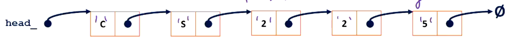
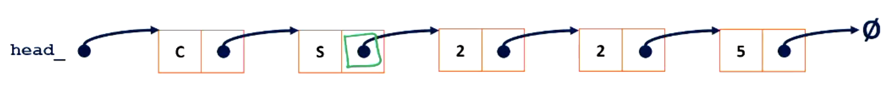
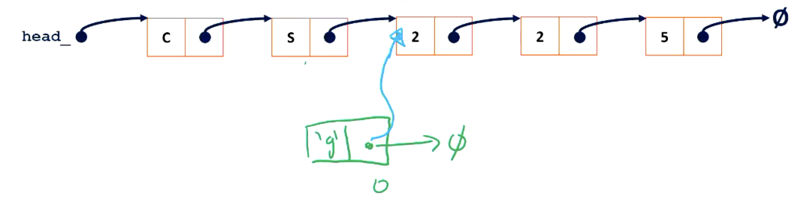
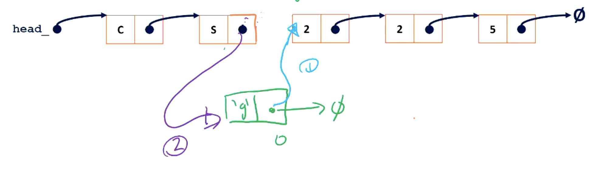

# Abstract Data Structure 

## List ADT

| List ADT - Basic Purpose | Function Definition      |
| ------------------------ | ------------------------ |
| Add item                 | `void List::add(...)`    |
| Remove item              | `void List::remove(...)` |
| Take an iterm on list    | `lst[0]`                 |
| Check empty              | `bool List::isEmpty()`   |
| Make empty list          | `List()`                 |

C++ 有类似的 **List ADT** ， 是 `<vector>`


### Linked List 

The `List.h` 
```cpp
#pragma once
template <typename T> 
class List {
    public:
        /* ... */
    private:
        // hide the implementation 
        class ListNode {
            const T data;
            ListNode * next;
            // constructor
            ListNode(const T & data) : 
                data(data), next(NULL) { }
            }; 
        
        ListNode *head_; 
};

```
The implementation `List.hpp`
#### Get insert to the front 
```cpp 
#include "List.h"

template <typename T>
void List<T>::insertAtFront(const T & t) {
    ListNode *node = new ListNode(t); 
    node->next = head_; 
    head_ = node; 
}

```
#### Print 
```cpp
template <typename T>
void List<T>::printReverse() const {
}

```

#### Get an element in the list 
We will return the **reference** to a pointer in this case, such that we can ***modify the address in that pointer*** later. 
Since the function ***returns a reference***, it should return some things like **the green object that is circled**. 


##### Get the next pointer of the Node 
**A reference to a pointer.**  
It will return the **"next pointer"** itself in that Node. 
Same as usual, **return as reference** allows you to ***modify the address value in the pointer***.

And `typename` is used to define a very long return type....
The very long **return type** is `List<T>::ListNode *&`. 

```cpp
template <typename T>
typename List<T>::ListNode *&
    List<T>::_index(unsigned index) {
        if (index == 0){
            return head_; 
        }else{
            ListNode *curr = head_; 
            while (index > 0){
                curr = curr->next; 
                index--; 
            }
            return curr->next; 
        }
}
```

##### Get the Content of the Node
Return the **reference** of T, it means you could modify the **T** in the ListNode.   
You could use `_index()` to implement indexing function. 

Think about what you will get when `*_index(i)` ... 
But you could use `_index(i)->data` to derefer the pointer.  

```cpp
template <typename T>
T & List<T>::operator[](unsigned index) {
    ListNode *& node = _index(index);
    return node->data; 
}
```

#### Get insert anywhere
Two steps to insert elements, 
- **Point** to the **next** node 
- **Update** the **previous** node 



Similar to **inserting a node at front**. 
Replace the `head_` with `node` ...
```cpp
template <typename T>
void List<T>::insert(const T & t, unsigned index) {
    ListNode *& node = _index(index); 
    ListNode *new_node = new ListNode(t); 

    new_node->next = node; 
    node = new_node; 
}
```

#### Remove an element 
You know how to get an element? uha?....
```cpp
template <typename T>
T List<T>::remove(unsigned index) {
}
```

### Array as List
**Array 必须是连续的**！
如果想插到前面就困难了。（必须 allocate 一个新的 array ， 然后把旧的复制进去， 删除以前的array）。

